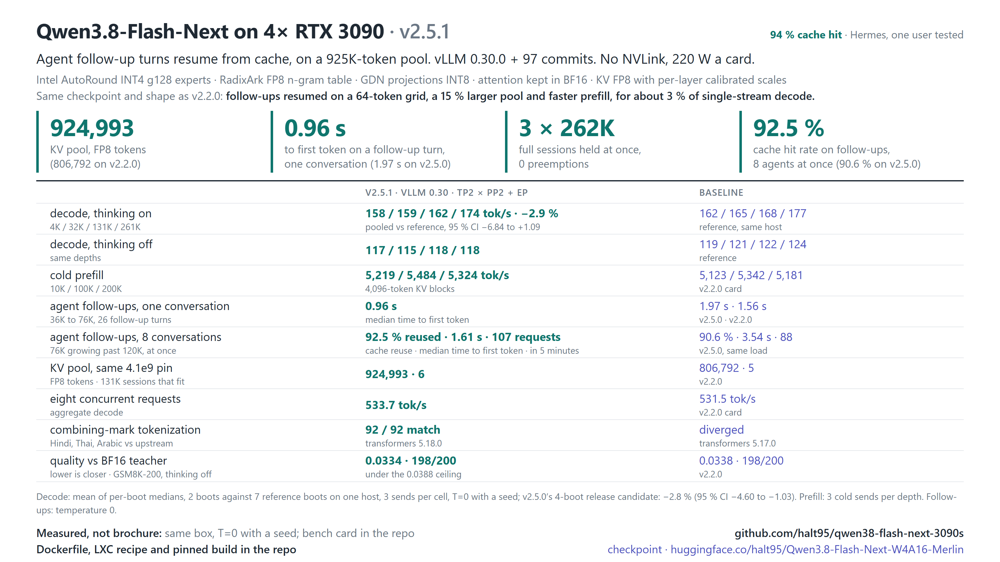

# Qwen3.8-Flash-Next on 4× RTX 3090

**Serve Qwen3.8-Flash-Next at its full 262K context on four RTX 3090s, with vision, tool calls and fast agent
follow-ups, behind one OpenAI-compatible endpoint.**

[](docs/reference.md#hardware)
[](docs/reference.md#the-kv-budget)
[](docs/reference.md#the-kv-budget)
[](docs/reference.md#stack)
[](docs/reference.md#stack)
[](https://huggingface.co/halt95/Qwen3.8-Flash-Next-W4A16-Merlin)



This repository is the serving engine for
[halt95/Qwen3.8-Flash-Next-W4A16-Merlin](https://huggingface.co/halt95/Qwen3.8-Flash-Next-W4A16-Merlin), a 4-bit
build of Qwen3.8-Flash-Next (125B MoE): the public vLLM `v0.30.0` tag plus 97 commits, hash-checked build and serve
scripts, and container and Proxmox LXC recipes. The whole KV cache stays in VRAM. It is the daily model behind a
[hermes](https://github.com/NousResearch/hermes-agent) agent. The current release is **v2.5.1**.

## Why use it

- **Long context that actually fits.** A 924,993-token FP8 KV pool: three full 262K sessions, or six 131K sessions,
  resident at once.
- **Built for agents.** Follow-up turns resume from cache: in one conversation the next turn starts in **0.96 s**; with
  8 agents at once, 92.5 % of follow-up tokens come from cache and the median follow-up starts in 1.61 s.
- **Fast.** About 160–175 tok/s single-stream (thinking on, MTP speculative decoding), 534 tok/s across 8 concurrent
  requests, and 5,200–5,500 tok/s prefill from 10K to 261K tokens.
- **Quality kept.** Every release is gated against the BF16 model: divergence 0.0334, the 262K needle found exactly,
  GSM8K 198/200, structured output 80/80.
- **Vision and tools.** Up to 42 images per request, Qwen3 tool calling and reasoning parsers.
- **Reproducible.** The build checks out a pinned commit and tree, and hash-checks every release asset and build
  product before it serves.

## What you need

- 4× RTX 3090 (24 GB, sm_86), headless, with no other CUDA process on them. PCIe peer-to-peer is recommended (it also
  runs without, with slower prefill); no NVLink needed.
- 96 GB of host RAM (the model's n-gram embedding table lives there; about 69 GiB is the hard floor), `/dev/shm` of at
  least 1 GB, and about 250 GB of free disk (the checkpoint is 115 GiB).
- Linux x86-64 with glibc 2.34 or newer, an NVIDIA driver with CUDA 13.0 or newer (the 580 series or later), Python
  3.13 with venv and headers, a C/C++ compiler, ninja, git and curl. The build installs its own CUDA 13.0 toolchain
  into the venv.

Where to get Python 3.13 on Debian 12 and Ubuntu, and the rest of the detail:
[Requirements](docs/reference.md#build-and-serve).

## Quick start

```bash
git clone --branch v2.5.1 https://github.com/halt95/qwen38-flash-next-3090s.git && cd qwen38-flash-next-3090s
R=https://github.com/halt95/qwen38-flash-next-3090s/releases/download
curl -fLO "$R/v2.5.1/v2.5.1-from-upstream-v0.30.0.bundle.gz" && gunzip v2.5.1-from-upstream-v0.30.0.bundle.gz
curl -fLO "$R/v2.2.0/build-artifacts-sm86-py313-cu130-v2.2.0.tar.gz"   # compiled ops, unchanged since v2.2.0
hf download halt95/Qwen3.8-Flash-Next-W4A16-Merlin --local-dir ~/models/Flash-Next-Merlin   # 115 GiB

BUNDLE=./v2.5.1-from-upstream-v0.30.0.bundle ARTIFACTS=./build-artifacts-sm86-py313-cu130-v2.2.0.tar.gz \
  scripts/build-v2.5.sh ./vllm-v2.5 ./venv-v2.5
TREE=./vllm-v2.5 VENV=./venv-v2.5 CACHE_ROOT=./.vllm-cache-v2.5 scripts/serve-v2.5.sh ~/models/Flash-Next-Merlin
```

`hf` is the Hugging Face CLI (`pipx install huggingface_hub`). The first start compiles kernels (about 6 minutes);
later starts take 2–3 minutes. The server is ready when the log shows `Application startup complete` and
`GPU KV cache size: 924,993 tokens`. It listens on `127.0.0.1:8000`; `HOST=0.0.0.0` opens it to the network, and then
set `VLLM_API_KEY` as well. More checks: [Check it's working](docs/reference.md#check-its-working); if something goes
wrong: [Troubleshooting](docs/reference.md#troubleshooting).

### Container

```bash
docker build -t qwen38-flash-next-3090s:v2.5.1 .   # in the clone; fetches the bundle and the compiled ops itself
MODEL_DIR=~/models/Flash-Next-Merlin docker compose up -d && docker compose logs -f flash-next
```

Run it in the clone, with the checkpoint downloaded as above (outside the clone). Needs `nvidia-container-toolkit` and
Docker Compose v2. The image has not been rebuilt or GPU-served on v2.5.1; the
bare-metal route above is the verified one. Details: [Container](docs/reference.md#container).

### Proxmox LXC

`lxc/` reproduces the reference host's privileged Debian 13 LXC with the four cards passed through:
[Proxmox LXC](docs/reference.md#proxmox-lxc).

## Talk to it

Any OpenAI-compatible client works. With curl:

```bash
curl http://127.0.0.1:8000/v1/chat/completions -H 'Content-Type: application/json' \
  -d '{"model": "flash-next", "messages": [{"role": "user", "content": "Hello!"}]}'
```

Or from Python with the `openai` package (set `OPENAI_API_KEY` to your `VLLM_API_KEY`, or to any value if you set none):

```python
from openai import OpenAI
client = OpenAI(base_url="http://127.0.0.1:8000/v1")
reply = client.chat.completions.create(model="flash-next", messages=[{"role": "user", "content": "Hello!"}])
print(reply.choices[0].message.content)
```

- Thinking is on by default. A short `max_tokens` can end inside the reasoning with empty `content`; send
  `"chat_template_kwargs": {"enable_thinking": false}` to turn it off for a request.
- Tools use the standard `tools` field; images go in `image_url` content parts, up to 42 per request.
- If a reply comes back empty with `finish_reason: "stop"` and zero tokens, retry once.

## What's new in v2.5.1

v2.5.0 was not published, so this is everything since v2.2.0, v2.5.0's changes included.

- Agent follow-up turns resume from cache on a 64-token grid, and a conversation's cached prefix is kept until its
  next turn: a follow-up starts in 0.96 s (v2.2.0: 1.56 s), and with 8 deep conversations 92.5 % of follow-up tokens
  come from cache (v2.2.0: 7.5 % on the same shape of load).
- The KV pool grows from 806,792 to 924,993 tokens (+15 %) on the same weights.
- Cold prefill is 1.0–2.8 % faster than v2.2.0; single-stream decode is about 3 % slower.
- Combining marks tokenize as intended (transformers 5.18.0), and a prompt can carry up to 42 images.

Full patch notes, with every measurement: [CHANGELOG.md](CHANGELOG.md).

## Documentation

- [CHANGELOG.md](CHANGELOG.md): release notes, newest first.
- [docs/reference.md](docs/reference.md): what the build and serve scripts do, environment variables, container and
  LXC detail, troubleshooting, how the model sits on the four cards, capacity, known behaviours and how it is measured.
- Bench cards: [v2.5.1](benchmarks/2026-10-06/BENCH-CARD.md),
  [v2.5.0 (not published)](benchmarks/2026-10-05/BENCH-CARD_OLD.md), [v2.2.0](benchmarks/2026-09-24/BENCH-CARD.md),
  [v2 gate](benchmarks/2026-09-17/BENCH-CARD.md), v1 ([2026-09-08](benchmarks/2026-09-08/BENCH-CARD.md),
  [2026-09-05](benchmarks/2026-09-05/BENCH-CARD.md)).
- [docs/topology-selector.md](docs/topology-selector.md): `AUTO_TOPO=1` for NVLink pairs and hosts with more than
  four GPUs.
- [docs/history.md](docs/history.md): earlier releases in full (v2.2.0, v2.0.1, v2, the v1 TP4 lane).

## Known limitations

- Only if you shrink the KV pool yourself: keep it larger than `--max-model-len` plus a few blocks. With the shipped
  settings (a 924,993-token pool, requests up to 262,144 tokens) this cannot occur.
- With 8 long agent sessions and a full pool, a few follow-ups (4 of 99 in 5 minutes) still re-read their whole
  conversation.
- Greedy (T=0) output repeats within one compile cache, not across fresh compiles.
- Tested on one setup: 4× RTX 3090 at 220 W, PCIe Gen4 x16, with peer-to-peer.

The full list, with causes and mitigations: [Known behaviours](docs/reference.md#known-behaviours-of-the-qwen38-flash-next-architecture-in-vllm).

## Credits

Qwen ([Qwen3.8-Flash-Next](https://huggingface.co/Qwen/Qwen3.8-Flash-Next)), Intel
([AutoRound INT4 experts](https://huggingface.co/Intel/Qwen3.8-Flash-Next-W4A16-AutoRound)), RadixArk
([FP8 PLE table](https://huggingface.co/RadixArk/Qwen3.8-Flash-Next-NVFP4)), DominikBucko
([MTP INT4 packing recipe](https://github.com/DominikBucko/qwen38-flash-next-2x3090)), the
[`peakcrosser7` Flash-Next branch](https://github.com/peakcrosser7/vllm/commits/release/qwen38next_offload) behind vLLM
PRs #53896 and #53899, and aikitoria's open-kernel-module patch (P2P on consumer Ampere). Upstream vLLM fixes in this
tree are credited by PR number in the commit messages and by author in `NOTICE` and in
[the full credit list](docs/reference.md#credit), which also names independent work on the same hardware class.

## License

Code in this repository (patches, scripts, calibration tooling, harness): Apache-2.0 (`LICENSE`); the vLLM
fork is Apache-2.0 with the modified files listed in `NOTICE`. Model weights, including the quantised
derivatives credited above, carry the Qwen Community License 1.0 (`LICENSE.qwen-community-1.0`); they are not
part of this repository.
