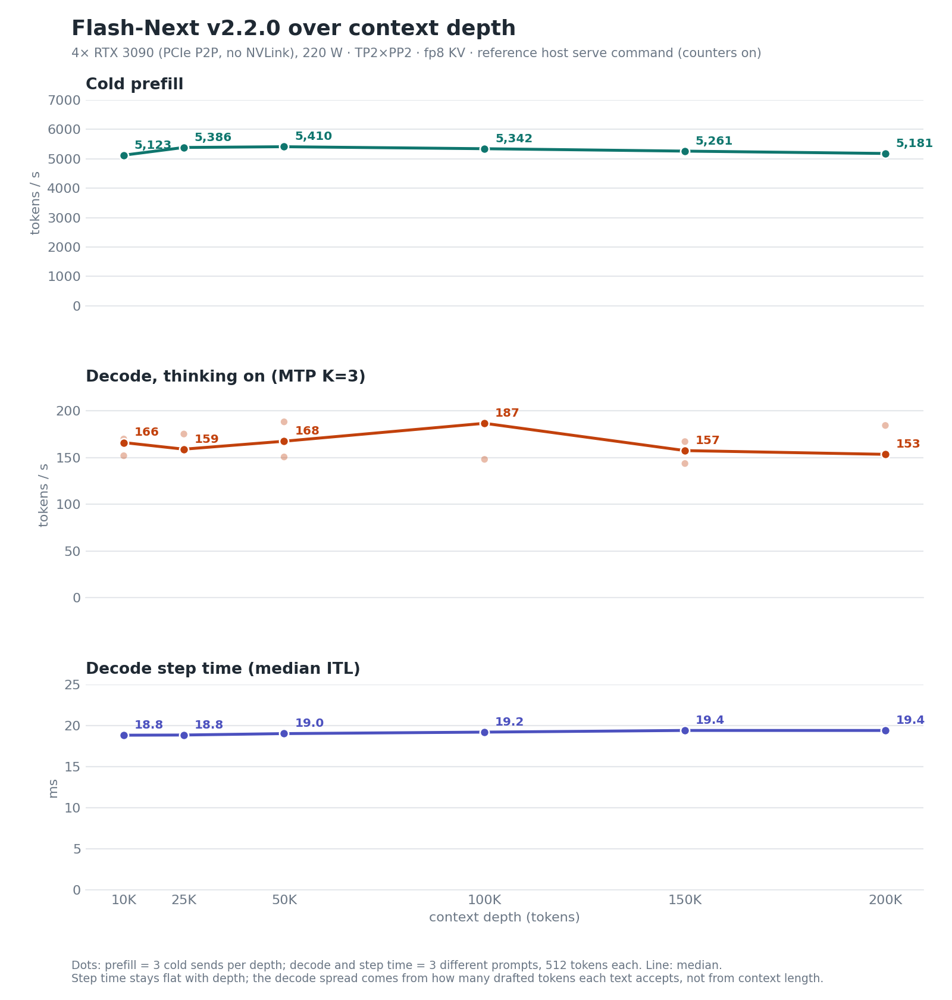

# v2.2.0 card — 2026-09-24 (parity check against v2, depth chart, configuration levers)

> **Provenance.** Maintainer measurements on the reference host (4× RTX 3090, 220 W, PCIe P2P, no NVLink; driver
> 610.43.02). v2.2.0 runs vLLM 0.30.0 + the v2.2.0 delta (the qualified tree; the published source differs from it as
> listed in the README, "Published source versus the qualified tree") on python 3.13.5, torch 2.13.0 (CUDA 13.0),
> triton 3.7.1, flashinfer 0.6.18.post1, with the reference host's serve command (determinism switches on, guard
> telemetry `warn`, the two logging-only counters on; `scripts/serve-v2.2.sh` ships the counters off, a different
> compiled variant, booted on the final tree only on a rented host without peer-to-peer; README, "Build and serve";
> no performance figures from it). Streams are client-timed. The ladder driver, raw streams and boot logs are not
> published (as for the earlier cards). v2.2.0 is a reliability release; this card shows it is at parity
> with v2, not faster.

## 1. Single-stream decode ladder against v2

The v2.2.0 column is one boot of the release candidate: the same kernels and model code as v2.2.0, with only the
Python process-supervision changes of the final tree added after it. The v2 column is the reference: the medians of
the five-boot gate that qualified v2 ([`../2026-09-17/BENCH-CARD.md`](../2026-09-17/BENCH-CARD.md)). Decode is tokens/s
over the streamed answer, T=0 with a seed, needle prompt at depth, ≤ 256 tokens, 3 sends per cell. With MTP, read the
median event interval (ITL) together with tokens per event, not tokens/s alone.

| prompt tokens | thinking | v2.2.0 t/s | v2 t/s | ratio | ITL ms (v2.2.0 / v2) | tokens/event (v2.2.0 / v2) |
|---|---|---|---|---|---|---|
| 4,096 | on | 160.0 | 162.2 | 0.986 | 18.98 / 18.72 | 3.02 / 3.02 |
| 4,096 | off | 119.7 | 118.2 | 1.013 | 19.12 / 18.66 | 2.30 / 2.21 |
| 32,768 | on | 165.6 | 166.3 | 0.996 | 19.05 / 18.73 | 3.12 / 3.07 |
| 32,768 | off | 127.9 | 123.0 | 1.040 | 18.98 / 18.81 | 2.43 / 2.31 |
| 131,072 | on | 168.9 | 169.4 | 0.997 | 19.50 / 19.10 | 3.19 / 3.13 |
| 131,072 | off | 121.3 | 123.3 | 0.984 | 19.25 / 18.97 | 2.31 / 2.35 |
| 261,120 | on | 175.1 | 176.2 | 0.994 | 19.54 / 19.33 | 3.32 / 3.28 |
| 261,120 | off | 121.8 | 125.2 | 0.973 | 19.55 / 19.15 | 2.35 / 2.37 |

Per-step time is 0.9 to 2.5 % higher in every cell. That is a combined difference of the determinism path and the
0.30 base; on one tree, the switches alone cost 1.2–2.2 % median step time at 65K–262K. Throughput lands at
0.973–1.040 of v2; tokens per event are equal or higher in six of the eight cells. One v2.2.0 boot against a
five-boot median; no confidence interval is claimed.

## 2. Aggregate throughput, accuracy and quality

| | v2.2.0 (release candidate) | v2.0.x (previous production build, 2026-09-23) |
|---|---|---|
| N=8 aggregate | 530.3 t/s | 526.6 t/s |
| N=1 aggregate | 118.9 t/s | 118.1 t/s |
| GSM8K-200, thinking off | 198/200 | 198/200 |
| MTP mean acceptance length | 3.31 | — |
| divergence from the BF16 teacher (24 held-out prompts; lower is closer) | 0.0338 (1 boot) | v2 gate: 0.0365–0.0378 (5 boots) |

On the final v2.2.0 tree, with the reference host's serve environment above (counters on): N=8 531.5 t/s,
N=1 117.8 t/s, GSM8K-200 198/200.

## 3. Prefill and decode over context depth (the chart)

Final v2.2.0 tree, the reference host's serve environment above (counters on), one boot.

- **ctx_pp** is cold prefill: 3 sends per depth, each with a unique nonce at the start of the first user turn, and
  every send asserted `cached_tokens == 0`.
- **ctx_tg** is decode with thinking on (`reasoning_effort` low), 512 tokens. At each depth, 3 different prompts,
  2 sends each; a prompt's value is the median of its 2 sends.
- **Step time** is the median inter-event interval of the same decode sends.
- In the chart every axis starts at zero; each faint dot is one send (ctx_pp) or one prompt (ctx_tg, step time), and
  the line joins the medians, whose values are printed.

| depth | ctx_pp t/s, median [min–max] | ctx_tg t/s, median [min–max] | per-prompt ctx_tg | step time ms, median [min–max] | tokens/event per prompt |
|---|---|---|---|---|---|
| 10K | 5,123 [5,099–5,138] | 166.1 [152.0–169.9] | 152.0 / 166.1 / 169.9 | 18.81 [18.56–18.96] | 2.86 / 3.07 / 3.18 |
| 25K | 5,386 [5,324–5,391] | 159.0 [157.1–175.2] | 157.1 / 159.0 / 175.2 | 18.83 [18.83–18.99] | 2.94 / 2.98 / 3.30 |
| 50K | 5,410 [5,406–5,420] | 167.5 [150.7–188.2] | 188.2 / 150.7 / 167.5 | 19.00 [18.91–19.17] | 3.58 / 2.83 / 3.16 |
| 100K | 5,342 [5,324–5,352] | 186.7 [148.1–187.7] | 187.7 / 148.1 / 186.7 | 19.19 [19.01–19.24] | 3.58 / 2.80 / 3.56 |
| 150K | 5,261 [5,256–5,263] | 157.5 [143.7–167.1] | 157.5 / 143.7 / 167.1 | 19.39 [19.34–19.48] | 3.05 / 2.77 / 3.22 |
| 200K | 5,181 [5,178–5,183] | 153.5 [152.4–184.4] | 152.4 / 153.5 / 184.4 | 19.39 [19.18–19.60] | 2.91 / 2.96 / 3.58 |

**Read the decode column through the step-time column.** Step time rises only 18.8 → 19.4 ms from 10K to 200K. The
spread in ctx_tg (144–188 t/s) tracks how many drafted tokens each text accepts (2.77–3.58 per event) more than
context length. A single-prompt decode series at these depths is a content draw; that is why each point here is a
median over three prompts.

Greedy output, and therefore MTP acceptance and decode t/s, is repeatable within one compile cache but can differ
between two fresh compiles of the same tree (README, Known behaviours). In one case a fresh compile moved a 100K
decode value from 153 to 188 t/s at the same step time (acceptance 2.89 → 3.58 tokens per event).

## 4. Configuration levers tested and not adopted

Each lever was one arm against a control boot of the same command on the same host, one boot per arm. Rule set in
advance: a lever wins if prefill improves by more than 5 % at 4 or more of 6 depths with no depth worse by more than
3 %, or median ITL improves by more than 3 % at both decode depths (4K, 100K) of a thinking mode with tokens per step
within ± 3 %; it loses if any cell regresses by more than 5 % or it does not boot. Anything else is neutral.

| lever | decode (median ITL vs control) | cold prefill 10K–200K (vs control) | verdict |
|---|---|---|---|
| `NCCL_MAX_NCHANNELS=4` / `NCCL_MIN_NCHANNELS=4` | −1.1 to −2.5 % | −0.11 to +0.08 % | neutral |
| PCIe-IPC all-reduce, `VLLM_ALLREDUCE_USE_FLASHINFER_PCIE_IPC=1` (upstream #53576) | +0.2 to −2.7 % | −0.50 to −0.09 % | neutral |
| MTP K=2 (greedy) | ITL −10 to −12 %, but net throughput 10–12 % lower in 3 of 4 cells | not run | loses (a cell regresses by more than 5 %) |
| sparse-indexer logits cap 64 / 256 (vLLM 0.30 opt-in) | within noise | — | neutral |
| FP8 indexer cache (vLLM 0.30 opt-in) | the engine does not boot: the kernel does not compile on sm_86 | — | loses (does not boot) |

How a cell is judged. For the NCCL-channel lever (N, first row) and the PCIe-IPC all-reduce lever (P, second row) the
decode cells are judged on median ITL (the drafter is unchanged, so tokens per step between two boots are a content
draw: with the switches off, T=0 output differs from boot to boot). K=2 changes the drafter itself, so, as written in
advance, it is judged on tokens per step divided by ITL. Judged that way, N and P would sit at 0.91 and 0.95 of
control in the 100K thinking-on cell (tokens per step 3.04 and 3.15 against 3.42) and at 0.96–1.01 in the other three;
the rule does not apply that metric to them, so they stay neutral, and neither is adopted. Percentages in the table
are computed from the per-cell medians.

The mamba-cache "align" mode is already in effect through prefix caching, so it was not tested separately. Adaptive
speculative verification in vLLM 0.30 applies only to another drafter family, not MTP.

These arms and their control ran with the determinism switches off (the code defaults), so the comparisons are
within one configuration. Control prefill there was 5,226–5,458 t/s, 1–2 % above the chart above (determinism
switches on).

## 5. Fault containment

On the final tree:

- 60/60 unit tests of the executor, engine core and PLE offload supervision.
- Fail-closed faults injected on 4 of 4 attempts (3 on TP rank 1, 1 on rank 0): each detected at +0.000 s from the
  fault marker, workers gone in 3.0–3.5 s, GPUs free in 3.8–4.6 s, client receives HTTP 500 `EngineDeadError`.
- The pre-fix candidate never completed the rank-1 case (engine hung until a 300 s RPC deadline) and stopped a rank-0
  fault in 11.4 s.

On release candidates before the final tree (the final tree also changes the fault-detection path and parts of the
same teardown code; these figures are from those candidates):

- Orderly shutdown: 2.65–3.55 s, from ~9.0 s before the drain-order fixes.
