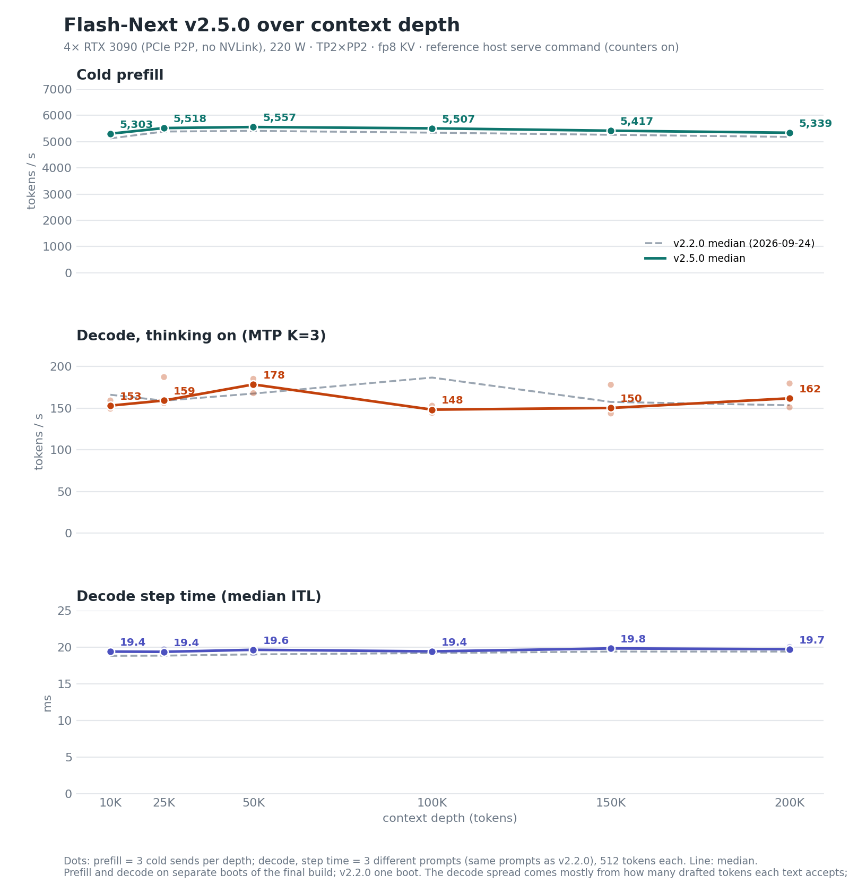

# v2.5.0 card — 2026-10-05 (against v2.2.0: decode ladder, multi-turn cache, capacity, depth chart)

> **Provenance.** Maintainer measurements on the reference host (4× RTX 3090, 220 W, PCIe P2P, no NVLink; driver
> 610.43.02). v2.5.0 runs vLLM 0.30.0 + the v2.5.0 delta (the qualified tree; the v2.5.0 release lists how the published
> source differs from it) on python 3.13.5, torch 2.13.0 (CUDA 13.0),
> triton 3.7.1, flashinfer 0.6.18.post1, transformers 5.18.0, with the reference host's serve command (determinism
> switches on, guard telemetry `warn`, the two logging-only counters on; the v2.5.0 serve script ships the counters
> off) and `--block-size 4096`. "Final build" below is the qualified tree of this release with its serve flags;
> "release candidate" is the same series before its last commit (the fused packed GDN forward under RecoverSSM) at the computed 3,392-token block; each
> figure says which it was measured on. Streams are client-timed. The drivers, raw streams and boot logs are not
> published (as for the earlier cards). v2.5.0 is a cache and capacity release: this card shows the larger pool, the
> multi-turn cache retention and faster cold prefill, at a single-stream decode cost of about 3 %.

## 1. Single-stream decode ladder against v2.2.0

One frozen ladder on one host: decode is tokens/s over the streamed answer, T=0 with a seed, needle prompt at depth,
≤ 256 tokens, 3 sends per cell; each column is the mean of the per-boot medians. The reference column is 7 boots: 2 of
v2.2.0 on 2026-10-04, interleaved with the release-candidate boots, and the 5-boot v2 gate of 2026-09-17, which
v2.2.0 matched at parity ([`../2026-09-24/BENCH-CARD.md`](../2026-09-24/BENCH-CARD.md)). With MTP, read the median
event interval (ITL) together with tokens per event, not tokens/s alone.

Final build, 2 boots:

| prompt tokens | thinking | v2.5.0 t/s | reference t/s | change | ITL ms (v2.5.0 / reference) | tokens/event (v2.5.0 / reference) |
|---|---|---|---|---|---|---|
| 4,096 | on | 161.5 | 162.0 | −0.3 % | 19.42 / 18.84 | 3.13 / 3.05 |
| 4,096 | off | 118.3 | 119.2 | −0.8 % | 19.51 / 18.76 | 2.30 / 2.24 |
| 32,768 | on | 159.6 | 165.1 | −3.3 % | 19.61 / 18.91 | 3.09 / 3.08 |
| 32,768 | off | 116.8 | 121.1 | −3.5 % | 19.68 / 18.91 | 2.29 / 2.29 |
| 131,072 | on | 163.8 | 168.4 | −2.8 % | 19.89 / 19.25 | 3.12 / 3.15 |
| 131,072 | off | 122.0 | 122.1 | −0.1 % | 19.80 / 19.22 | 2.39 / 2.33 |
| 261,120 | on | 168.2 | 177.0 | −4.9 % | 20.16 / 19.42 | 3.30 / 3.32 |
| 261,120 | off | 118.5 | 124.2 | −4.6 % | 20.09 / 19.39 | 2.37 / 2.38 |

**Pre-registered measure** (fixed before the repeat boots ran): one index per boot, the mean over the four
thinking-on cells of the boot's tokens/s divided by the reference mean of that cell; Welch t-test, two-sided. On the release
candidate (4 boots) v2.5 is **2.81 % slower** than the reference (95 % CI −4.60 % to −1.03 %, p = 0.0087). The final build reads −0.01 %
against the release candidate (95 % CI −3.05 % to +3.03 %, 2 boots against 4) and −2.84 % against the reference (95 % CI
−6.41 % to +0.74 %, 2 boots against 7). Per-cell confidence intervals with 2 boots are wide and are not shown. Tokens per event
match; the event interval is 0.6–0.8 ms longer: RecoverSSM's speculative verify runs the Triton GDN decode kernel and
replays the state on every step.

## 2. Aggregate throughput, multi-turn cache, accuracy and quality

| | v2.5.0 | v2.2.0 |
|---|---|---|
| N=8 aggregate | 535.2 t/s (final build) | 531.5 t/s (final tree, 2026-09-24) |
| N=1 aggregate | 127.8 t/s (final build) | 117.8 t/s (final tree, 2026-09-24) |
| multi-turn: follow-up cache reuse, 8 concurrent agent sessions growing to 80K | **82.0 %** (final build) | 7.5 % |
| multi-turn: median time to first token on follow-up turns, same load | **3.9 s** (final build) | 52.7 s |
| GSM8K-200, thinking off | 198/200 (final build) | 198/200 |
| MTP mean acceptance length (served logging window) | 3.33 (final build) | 3.31 |
| divergence from the BF16 teacher (24 held-out prompts; lower is closer; ceiling 0.0388) | 0.0334 (final build, 4 captures) | 0.0338 (1 boot) |
| structured output, 80 requests over four load cells | 80/80 (final build) | 80/80 |
| 262,144-token needle (261,568 prompt tokens) | exact (final build) | exact |
| 90-minute mixed soak | 11,002 requests, 0 errors, 0 HTTP 5xx (release candidate) | 12,115 requests, 0 errors |

The aggregate rows are one boot each and not same-day (v2.2.0's are from its own card); read them as
unchanged within run-to-run noise. The multi-turn rows are the load that reproduced the cache issue reported on Hugging Face (discussion #2): each
session is a shared tool prefix, a unique history and turns that append a reply and a new tool result, 8 sessions at
once. On v2.2.0 a running request's Gated-DeltaNet prefix checkpoint could be evicted before it finished, so most
follow-up turns re-prefilled the whole conversation; v2.5.0 retains it. At the 3,392-token block the release candidate
measured 85.8 % and 3.3 s; the 4,096-token block lands prefix hits in larger blocks, so each follow-up re-prefills up to
about 700 more tokens. The divergence metric is defined in the v2.2.0 card
([`../2026-09-24/BENCH-CARD.md`](../2026-09-24/BENCH-CARD.md)).

## 3. Capacity

| | v2.5.0 | v2.2.0 |
|---|---|---|
| KV pool, FP8 tokens, `--kv-cache-memory 4100000000` | **924,993** (attention block 4,096; 248 blocks) | 806,792 (block 3,200) |
| full 262,144-token sessions resident at once | 3, 0 preemptions; a fourth not resident (final build) | 3 on v2; v2.2.0 re-tested at 3 × 256K |
| 131,072-token sessions resident at once | **6**, 0 preemptions; a seventh not resident (final build) | 5 |
| full-pool pressure, 8 sessions | preempted 181 and 138 times in two runs; 8/8 completed correctly (release candidate) | pool driven to 100 % with preemptions, no failed request |
| without MTP (same command minus `--speculative-config`) | pool 1,057,314 at the computed block; 3 × 262K and 7 × 131K resident (release candidate) | — |

The pool grows because the Gated-DeltaNet speculative-decoding state is recovered by replay (`--use-replayssm`,
upstream #58863) instead of being kept per draft token, together with a side-cache layout change. Session token
totals overstate capacity: each session also holds fixed Gated-DeltaNet state blocks, so count sessions, not tokens.

## 4. Prefill and decode over context depth (the chart)

The final build, the reference host's serve environment above (counters on); prefill on one boot, decode on a second.
Same driver, cells and prompts as the v2.2.0 chart, whose medians are the dashed line.

- **ctx_pp** is cold prefill: 3 sends per depth, each with a unique nonce at the start of the first user turn, and
  every send asserted `cached_tokens == 0`.
- **ctx_tg** is decode with thinking on (`reasoning_effort` low), 512 tokens. At each depth, 3 different prompts (the
  same three as v2.2.0), 2 sends each; a prompt's value is the median of its 2 sends.
- **Step time** is the median inter-event interval of the same decode sends.
- In the chart every axis starts at zero; each faint dot is one send (ctx_pp) or one prompt (ctx_tg, step time), the
  line joins the medians, whose values are printed, and the dashed line is the v2.2.0 median.

| depth | ctx_pp t/s, median [min–max] | vs v2.2.0 | ctx_tg t/s, median [min–max] | per-prompt ctx_tg | step time ms, median [min–max] | tokens/event per prompt |
|---|---|---|---|---|---|---|
| 10K | 5,303 [5,297–5,310] | +3.5 % | 153.1 [149.3–159.2] | 153.1 / 159.2 / 149.3 | 19.38 [19.24–19.40] | 2.93 / 3.07 / 2.88 |
| 25K | 5,518 [5,509–5,529] | +2.5 % | 159.2 [156.1–187.3] | 159.2 / 156.1 / 187.3 | 19.36 [19.31–19.70] | 3.07 / 2.99 / 3.66 |
| 50K | 5,557 [5,543–5,558] | +2.7 % | 178.5 [168.0–185.2] | 178.5 / 168.0 / 185.2 | 19.63 [19.16–19.68] | 3.48 / 3.20 / 3.61 |
| 100K | 5,507 [5,496–5,512] | +3.1 % | 148.2 [144.3–152.9] | 152.9 / 144.3 / 148.2 | 19.41 [19.27–19.60] | 2.93 / 2.81 / 2.86 |
| 150K | 5,417 [5,412–5,424] | +3.0 % | 150.3 [143.7–178.1] | 150.3 / 143.7 / 178.1 | 19.82 [19.82–19.99] | 2.96 / 2.83 / 3.53 |
| 200K | 5,339 [5,338–5,342] | +3.1 % | 161.8 [151.0–179.7] | 151.0 / 161.8 / 179.7 | 19.71 [19.61–20.02] | 2.96 / 3.15 / 3.57 |

**Cold prefill is 2.5–3.5 % above the v2.2.0 card** at every depth (not same-day; the gate's own prefill harness
against v2.2.0 boots of 2026-10-04 gives +2.4 to +3.0 % at 10K and 100K). **Read the decode column through the step-time column.**
Step time is 19.4–19.8 ms from 10K to 200K, 0.2–0.6 ms above v2.2.0 at each depth; the ctx_tg spread tracks how
many drafted tokens each text accepts (2.81–3.66 per event). One boot per release, so a single depth's decode difference
against v2.2.0 is a content draw; section 1's repeat boots are the measure of the decode cost.

## 5. How the release candidate's prefill cost was recovered

The release candidate (RecoverSSM, computed 3,392-token block) prefilled 6–12 % below v2.2.0 (same-day repeat boots:
−7.3 % at 10K, −11.2 % at 100K; every boot within 1 %). Attributed with fresh-cache boots on one day, cold prefill at
10K / 100K, 3 sends each:

| configuration | 10K | 100K | pool |
|---|---|---|---|
| release candidate (all on) | 4,798 | 4,706 | 929,987 |
| GDN checkpoint retention off | 4,793 | 4,708 | 929,987 |
| side-cache layout off | 4,778 | 4,710 | 900,931 |
| RecoverSSM off (block 3,200) | 5,172 | 5,359 | 853,994 |
| RecoverSSM on, `--block-size 3456` | 4,822 | 4,808 | 936,685 |
| **RecoverSSM on, `--block-size 4096`** | **5,344** | **5,525** | **924,993** |
| final build (4,096 + fused packed forward kept on) | 5,303 | 5,507 | 924,993 |

A torch-profiler comparison of a cold 32K prefill (release candidate against RecoverSSM off) found the Gated-DeltaNet
layers on the unfused forward under RecoverSSM: about five times the INT8 projection GEMM launches, a saturated launch
queue and longer pipeline waits. The final build keeps the fused packed forward under RecoverSSM and sets the block to
4,096 tokens, four 1,024-token prefill chunks per block; at 4,096 the fused-forward change measured within 1 % of the
block change alone.

## 6. Greedy repeatability at depth (release candidate)

Eight identical T=0 requests per depth, prefix cache off, 256 tokens generated, one compile cache:

| prompt tokens | with MTP (distinct outputs of 8) | without MTP | control: kernel switches off, with MTP |
|---|---|---|---|
| 65,536 | 1 | 1 | 5 |
| 130,948 | 1 | 1 | 8 |
| 134,997 | 1 | 1 | 8 |
| 200,000 | 1 | 1 | 8 |
| 261,800 | 1 | 1 | 8 |

The control boot shows the test can fail. The guard counters stayed at zero on every cell. Fresh compiles of the
same tree can still differ (README, Known behaviours). Without MTP, single-stream decode is about 82 t/s at 65K–262K.

## 7. Fault containment and shutdown (release candidate)

- Rank 0: four injected PLE faults failed closed, workers gone in 3.1–5.0 s and GPUs free in 3.7–5.0 s.
- Any rank: 4 of 4 injections failed closed (3 on TP rank 1, 1 on rank 0), each detected at +0.000 s from the fault
  marker; 60/60 unit tests of the executor, engine core and PLE offload supervision.
- Orderly shutdown completed on all 4 ranks on both release-candidate boots.
- A boot with the shipped-default variables absent (`VLLM_E2_PLE_PULL_TRANSPORT`, the five `MERLIN_` switches,
  `VLLM_E2_GUARD_MODE`) used the same pool, enabled the switches on every rank, and passed needle, thinking and
  no-thinking checks.
- Final build: 0 engine errors over the gate's two boots and the depth and bench runs.
