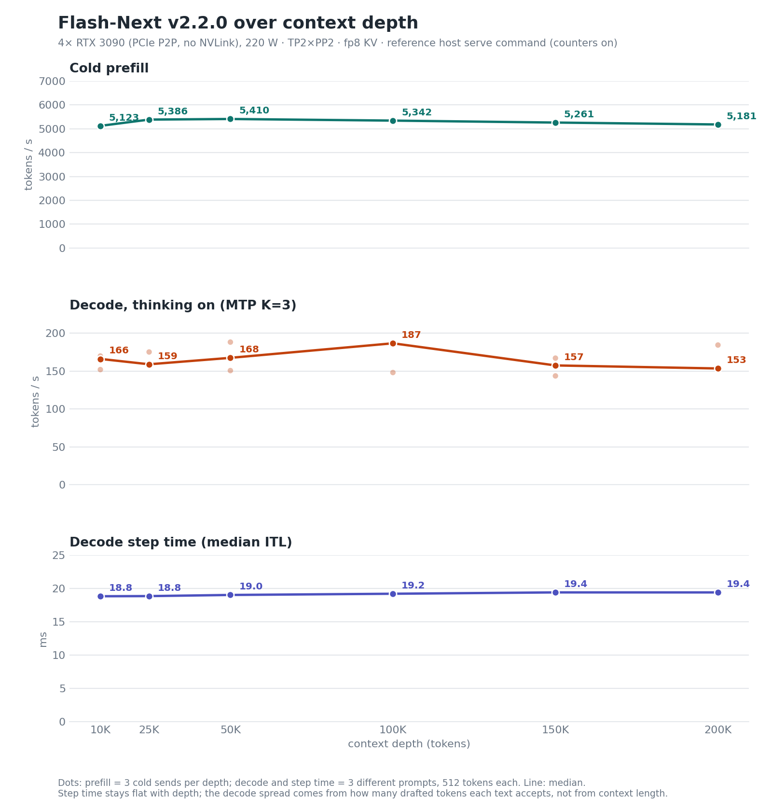

# Release history

Earlier release notes, moved here from the [README](../README.md). The current release is v2.5.1; its notes are in
[CHANGELOG.md](../CHANGELOG.md#what-changed-in-v251).

## The releases in brief (v2.5.1, v2.2.0, v2.0.1, v2)

**v2.5.1** (2026-10-06) makes agent follow-up turns resume from cache: a follow-up resumes on a 64-token grid instead of the 4,096-token block, and the Gated-DeltaNet checkpoint and cached prefix a conversation needs are held until its next turn is admitted. It also increases the KV pool to 924,993 tokens, measures three 262,144-token sessions resident at once, updates combining-mark tokenization, supports prompts with up to 42 images, and aligns unset environment variables with the shipped launcher. Single-stream decode is about 3 % slower than v2.2.0; eight-concurrent-request throughput is effectively unchanged. v2.5.0 was not published. See [What changed in v2.5.1](../CHANGELOG.md#what-changed-in-v251).

**v2.2.0** (2026-09-25) moves the same shape onto vLLM 0.30.0 (the public `v0.30.0`
tag plus 58 commits) and is a reliability release, at parity with v2:
[greedy repeatability, any-rank fault detection and faster shutdown](#what-changed-in-v220). **v2.0.1** (2026-09-18) is
the v2 shape plus one engine fix, [structured output under concurrency](#what-changed-in-v201). **v2**
(2026-09-17) keeps everything the [v1 release](#v1-the-tp4-lane) established (calibrated FP8 KV for the
sparse-attention layers, full cudagraphs, three-token speculative decoding) and changes the shape: **tensor
parallel 2 × pipeline parallel 2** with expert parallel, the FP8 n-gram table served to the GPUs over a
**host-mapped, fail-closed pull transport**, and, the piece that is entirely ours, **the engine's token-embedding copies
for both the target model and the MTP drafter moved out of VRAM into pinned host memory**, read by a device-mapped
lookup that runs inside the captured cudagraph. The KV pool goes from 342,912 tokens (1.31 full-context requests) to
**806,792 tokens: three full 262,144-token sessions measured resident at once**, thinking-on single-stream decode at parity with the TP4 lane
(thinking-off at 4K measured 5 % below it in the v2 gate; a later re-test put it at parity, see Known behaviours),
prefill 10–26 % faster. The v2-versus-v1 table below comes from the pre-registered two-arm gate that qualified v2
([`benchmarks/2026-09-17/BENCH-CARD.md`](../benchmarks/2026-09-17/BENCH-CARD.md)); v2.0.1 was requalified against those
medians (maintainer-reported); capacity, memory, fault and prefix-cache figures are maintainer-reported from the
campaign's close records, which are not published.
## What changed in v2.2.0

**v2.2.0 is rebased on vLLM 0.30.0 and needs the new runtime.** v2.0.x ran on a 0.28-era nightly plus a community
branch; v2.2.0 is the public `v0.30.0` tag plus 58 commits. It cannot be dropped into a v2.0.x environment: it needs
the vLLM 0.30.0 runtime (python 3.13, torch 2.13.0 with CUDA 13.0, triton 3.7.1, flashinfer 0.6.18.post1), its own two
compiled extensions and a new compile cache. Unchanged: the checkpoint, `config.json`, the KV-scale sidecar, the serving
shape (TP2 × PP2 + EP, MTP K=3) and the 806,792-token pool. Build it with `scripts/build-v2.2.sh`, serve it with
`scripts/serve-v2.2.sh` ([Build and serve](https://github.com/halt95/qwen38-flash-next-3090s/blob/v2.2.0/README.md#build-and-serve)).

**Published source versus the qualified tree.** The published source is the qualified tree with internal working
labels and dates (task, run and design-note references) removed from comments, docstrings, log text, commit messages
and file names. It differs from that tree only in: comments, docstrings, log/error message text, test-only labels in
test data and one reader-thread name; identifier renames, namely the fork's switch prefix, published as `MERLIN_*`
(environment variable names, the C++ `getenv` names, the build defines and helper functions derived from them, and the
test helpers), and a few test and helper names (`medium_*`, `tiedet_*`, `largedet_*`, `REPLAY_SENTINEL_*`, `pre_tag`,
the `isolated`-process tests and their constants, `_gpu_host_tier`, one test's report-directory variable); two
internal design notes that are not shipped; nineteen test and probe files renamed (one test import follows a rename).
With those renames mapped back, Python is AST-identical once docstrings and the changed string constants (log/error
text, the thread name, test labels) are normalised, C++ is token-identical outside comments and string literals, and
every file present in both trees keeps its line count. Both compiled extensions are rebuilt from the published source;
their device code matches the qualified builds instruction for instruction for every kernel the release changes and
every kernel on this model's path, identified by kernel name (`cuobjdump -sass`, after normalising per-build symbol
hashes). 24 upstream kernels on paths this model does not use differ (MiniMax-M3 / Kimi-K3 fused ops, the DeepGEMM fp8
silu-mul quant and the fp8 MoE finalize); the likely cause, not isolated, is the older host compiler of the build root
(Ubuntu 22.04, gcc 11, chosen so that the extensions load on glibc 2.34). The unit tests give the same per-test results
on both trees.

It is a **reliability release, at parity with v2, not faster**: decode lands at 0.973–1.040 of v2 in every cell of
the ladder (v2.2.0: one release-candidate boot; v2: five-boot gate medians; no confidence interval is claimed).
Per-step time is 0.9–2.5 % higher in every cell, a combined difference of the determinism path, the 0.30 base and the
instrumentation: v2.2.0 was measured with the guard reader in `warn` and both logging counters on, v2 with the readers
off, and those readers cost ~0.3–0.5 ms per step in the v2 campaign ([Benchmarks](reference.md#benchmarks)). The switches alone
cost 1.2–2.2 % at 65K–262K on one tree; tokens per step are equal or higher in six of the eight cells
([`benchmarks/2026-09-24/BENCH-CARD.md`](../benchmarks/2026-09-24/BENCH-CARD.md)).



Cold prefill runs 5,123–5,410 t/s from 10K to 200K tokens. Decode with thinking on (`reasoning_effort` low, 512 tokens) is 153.5–186.7 t/s (median of three
different prompts per depth; one boot). Step time moves little with depth (18.8 → 19.4 ms), and most of the decode
spread tracks how many drafted tokens each text accepts (2.77–3.58 per step) rather than context length.

**Greedy output repeats within one compile cache.** Four switches remove three sources of run-to-run variation in
T=0 decoding: `MERLIN_FULL_K=1` (Marlin MoE split-K reduction order), `MERLIN_QSA_SORT=1` (order of the blocks the
sparse-attention top-k selects), `MERLIN_TIE_DET=1` and `MERLIN_TIE_RECENT=1` (how ties at the top-k cutoff are broken
and which are kept). On release candidates, with prefix caching off and thinking off, 8 identical T=0 requests gave
**1 distinct output** in every sampled cell from 3,960 to 261,802 prompt tokens; with the switches off, the deep cells
gave 4 to 8 distinct outputs of 8. These are sampled results, not a batch-invariance guarantee, and they hold only
within one compile cache (Known behaviours). The top-k kernel also emits its selection in canonical order itself
(`MERLIN_TOPK_SORTED_EMIT=1`): output-identical to the Python sort it replaces, and 1.9–3.0 % lower median step time
in one boot per arm.

**A fail-closed fault on any GPU rank now stops the engine.** A fail-closed PLE fault on a non-zero tensor-parallel rank
used to hang the engine: that worker's exit pipes had been inherited by a `torch_shm_manager` helper that outlived it,
so the executor never saw the death and blocked in an RPC until its 300 s timeout
(`VLLM_EXECUTE_MODEL_TIMEOUT_SECONDS`). The defect is in v2.0.x as well; no
earlier fault campaign exercised that case. v2.2.0 adds a per-worker fault pipe (the worker writes one byte before
`os._exit`), a pidfd exit monitor with the sentinel as fallback, covering the whole initialisation window, and
close-on-exec on the inherited pipes. Measured on the final tree: an injected fail-closed fault on rank 1 is detected at
+0.000 s, workers are gone in 3.0–3.5 s and the client gets HTTP 500 `EngineDeadError`. This covers fail-closed PLE
faults and worker exits; a GPU that hangs without exiting is not covered by these measurements.

Separately, drain-order fixes shorten orderly shutdown from ~9.0 s to 2.65–3.55 s: a late SIGTERM during teardown is
survived, workers exit right after their orderly shutdown, and a failure that races shutdown still exits 1. These
shutdown figures come from release candidates before the final tree, which also changes the fault-detection path and
parts of the same teardown code.

**Other fixes.**

- The rare illegal-address engine death (Known behaviours) is contained: every sparse-attention raw-key ring row is
  tagged and validated before pooling, so a stale or uncommitted row is no longer read as a key or a RoPE position. A
  mismatched row is counted at an always-fatal guard site: with the shipped `GUARD=warn` the engine stops with a named
  cause instead of an illegal-address fault (the failure boundary is the engine, not the request). With `GUARD=off`,
  the code default, the row is masked and counted, nothing reads the counter, and the affected group's compressed
  slot is left unwritten, so that setting is not a silent-safe alternative. A seeded replay faults on the old tree
  and is caught on the new one. The fault is contained, not proven absent: the check did not fire in the release
  candidates' 90-minute soak (12,115 requests) or three 15-minute stress runs, but the original fault was seen only
  twice in the whole campaign, so no rate is claimed.
- A hang in the PLE fatal path is fixed: the traceback formatter no longer runs exception-defined code before `os._exit`.
- The PLE pull operator resolves live pointers by layer name, so the compile cache no longer bakes addresses in.
- Carried or re-ported onto 0.30: #54793 / #54795 (PP), #54442 / #56802 (structured output under concurrency, the
  v2.0.1 fix), #46994 (MTP under PP), #57050, #48532, #50021, #55506, #55557.

**Serve-command changes against v2.0.1** (all in `scripts/serve-v2.2.sh`):

- `VLLM_PLE_CPU_OFFLOAD=1` becomes **`VLLM_E2_PLE_PULL_TRANSPORT=1`**. vLLM 0.30 reuses the old name for its own PLE
  backend with the opposite default; the tree refuses to boot with both on.
- `VLLM_USE_BREAKABLE_CUDAGRAPH=0`, exactly `"0"`: 0.30 would otherwise switch this architecture to breakable graphs
  and turn compilation off. The tree's profile guard refuses anything but the qualified shape.
- The four determinism switches and `MERLIN_TOPK_SORTED_EMIT=1`. They are compile factors: changing one costs a fresh
  compile.
- `VLLM_E2_GUARD_MODE=warn`: bounds-guard telemetry on. Hits are reported, and the designated fatal sites (among them
  the ring-row validation site) stop the engine with a named cause instead of masking the row silently. The code
  default is `off` in v2.2.0 (a comment in the tree says otherwise; the comment is wrong); `warn` since v2.5.
- **A first-serve toolchain.** FlashInfer compiles its prefill, sampling and top-k kernels on the first request and
  Triton compiles its launchers, so serving needs a C/C++ compiler, ninja, the Python 3.13 headers and an nvcc no newer
  than the driver. `build-v2.2.sh` installs the CUDA 13.0 nvcc/crt/nvvm/cccl wheels into the venv (PTX any CUDA 13.0+
  driver accepts) and the `lib64` and unversioned library links FlashInfer and cmake look for; `serve-v2.2.sh` points
  `CUDA_HOME` at them and checks compiler, ninja, headers and nvcc-versus-driver before starting. On Debian/Ubuntu:
  `apt install gcc g++ ninja-build` (RHEL 9: `dnf install gcc gcc-c++`, with `ninja-build` from CRB or EPEL), plus the Python 3.13 headers (`python3.13-dev` on Debian 13, or from the deadsnakes
  PPA on Ubuntu; uv and pyenv Pythons ship them; see Requirements). Two differences from the reference host: it compiles these kernels
  with its system CUDA 13.3 toolkit (`CUDA_HOME=/usr/local/cuda`; set `CUDA_HOME` to do the same), and its venv
  carries CUDA 13.4 toolkit wheels it does not use, which `requirements-pinned.txt` replaces with the 13.0 ones (four
  pins: nvcc, crt, nvvm, cccl). Every other pin is the reference venv's.
- The two logging-only counters (exact-restart counters every 30 s, FP8 KV clip counter every 300 s) are **off by
  default** (`COUNTERS=1` opts in). The reference host ran them, and the published numbers were measured with them on,
  but the clip counter's reader starts before cudagraph capture and can overlap it on a fresh-compile boot. The clip
  counter is a compile factor, so the default is a different compiled variant from the measured one: on the final
  tree it was booted only on the rented host without peer-to-peer (three boots, [Build and serve](https://github.com/halt95/qwen38-flash-next-3090s/blob/v2.2.0/README.md#build-and-serve);
  correct answers, no performance comparison).
- Inherited fork knobs (test-only fault injectors, diagnostics, timeouts, a correctness switch turned off by hand) are
  cleared before the qualified values are set.
- A **new** `VLLM_CACHE_ROOT`: 0.28-era compile artefacts do not carry over. First boot ~6 min, later boots ~3 min.
  The kernels FlashInfer compiles on the first request are cached outside it, under `~/.cache/flashinfer`
  (`FLASHINFER_WORKSPACE_BASE` replaces `~` in that path; the container sets it under `/cache`).
- Keep model runner V2 (the 0.30 default).

Rollback is pointing the entry back at the v2.0.x tree, environment and cache; nothing in the checkpoint changed.


## v2 against v1 at a glance

| | **v2** | v1 TP4 build (same gate, same box; † see the note under the table) |
|---|---|---|
| shape | TP2 × PP2 + expert parallel, MTP K=3 | TP4 + EP, MTP K=3 |
| KV pool, FP8 tokens, whole box | **806,792** (3.08 × a full-context request; three full 262,144-token sessions resident, measured at a peak of about 95 % of the pool) | 342,912 (1.31 ×) |
| context per request | 262,144 | 262,144 |
| concurrent sequences admitted (`--max-num-seqs`, configured; the shapes listed were measured resident) | **8** (3 × 262K, 1 × 262K + 3 × 131K, 5 × 131K, 8 × 65K, 8 × 32K) | 2 |
| decode, single stream, thinking on, 4K / 32K / 131K / 261K prompt | **162 / 166 / 169 / 176** tok/s (medians of 5 boots) | 163 / 165 / 172 / 170† |
| decode, thinking off, same depths | 118 / 123 / 123 / 125 | 124 / 122 / 120 / 125† |
| median event interval, thinking on, same depths | 18.72 / 18.73 / 19.10 / 19.33 ms | 18.61 / 18.73 / 19.17 / 19.37† ms |
| MTP tokens per step, thinking on, same depths | 3.02 / 3.07 / 3.13 / 3.28 | 3.00 / 3.04 / 3.17 / 3.24† |
| prefill, 10K / 100K / 261K prompt | **4,944 / 5,282 / 5,122** tok/s | 4,498 / 4,194 / — |
| time to first token, cold, 4K / 32K / 131K / 261K | 0.91 / 6.19 / 24.77 / 50.68 s | 0.97 / 7.16 / 31.94 / — s |
| quality vs the BF16 teacher (mean absolute per-token log-probability difference, teacher-forced, against this checkpoint served with a BF16 KV cache; 24 held-out prompts, 5 boots; lower is closer; [definition](reference.md#benchmarks)) | 0.0365–0.0378 | 0.0378–0.0385 |
| tool-call structure (150 cases) / exact recall (160 cases) | 130/150 / 160/160 | reference quant 125/150 / 160/160 (parity band, ≥ ref − 2) |
| vision | on, 2 images per request | on |

† v1 at 261K was measured on 2026-09-18, after the gate, in one boot with three sends (170.1 / 124.6 tok/s; median event
interval 19.37 / 19.40 ms; 3.24 / 2.39 tokens per step, thinking on / off). Every other v1 cell is a median of five boots;
the 261K depth was preregistered for the v2 arm only, so v1 prefill and time to first token at that depth are not measured.

Decode is the streamed event rate over the answer, client-timed at T=0 with a fixed seed (the gate's protocol; the
served entry defaults to T=1.0 / top-p 0.95 / top-k 20 and the numbers were not re-measured under those defaults,
nor under the served entry's request-logging-off flags). With MTP the honest pair is the **median event interval**
(v2 18.7 / 18.7 / 19.1 ms vs v1 18.6 / 18.7 / 19.2 at 4K / 32K / 131K) and **tokens per step** (3.02 / 3.07 / 3.13
vs 3.00 / 3.04 / 3.17), both in the card.

## What changed in v2.0.1

**Structured output now works under concurrency.** In v2, a `response_format` request could fail with HTTP 500 while
other requests were decoding, because the draft hand-off kept a single unidentified slot that the alternating
pipeline-parallel microbatch overwrote; the `-1` placeholders left behind gave the grammar bitmask an all-allowed row
and the unconstrained token then failed the state machine. v2.0.1 ports two upstream pull requests (both open upstream at the time of writing) that fix it at the source:
**PR #54442**, which refuses to leave an unmasked row for a draft slot the scheduler did not schedule, and **PR #56802**,
which keys draft snapshots by scheduler step so a request is verified against the drafts its own step consumed.

Measured on the reference host with the shipped serve command, 80 structured requests across four load cells (one, two
and three concurrent decodes with thinking on, and two with thinking off), 10 idle and 10 under load in each:

| Concurrent decodes | Thinking | v2: schema-valid responses of 10, under load | v2.0.1: same |
|---|---|---|---|
| 1 | on | 8/10 | 10/10 |
| 2 | on | 1/10 | 10/10 |
| 3 | on | 2/10 | 10/10 |
| 2 | off | 6/10 | 10/10 |

Idle was 10/10 in every cell on both. Every v2.0.1 response body validated against its schema; the engine logged no
grammar rejection and no terminated request anywhere in the run. No throughput regression was found: on the
reference host's two-boot ladder across 4K, 32K, 131K and 261K in both thinking modes, v2.0.1 lands between 0.978 and
1.028 of the v2 median, with median inter-token latency within 0.21 ms and tokens per step unchanged. The
prefix-cache equivalence block was re-run too and fails identically on v2 and v2.0.1 (same three cells, same cache-hit
total, 51/51 answers correct on both): that is the open [prefix-cache loss](reference.md#known-behaviours-of-the-qwen38-flash-next-architecture-in-vllm),
unchanged by this fix.

Nothing else about the release changes: same checkpoint, same serve command, same KV budget, same pool of 806,792
tokens. Upstream PR #43650 is deliberately **not** ported, because this tree's cache coordinator already caps a Mamba
cache hit at the attention groups' post-drop length and dropping again would shrink every warm hit for no gain.
The requalification record is not published; the two upstream pull requests
([#54442](https://github.com/vllm-project/vllm/pull/54442), [#56802](https://github.com/vllm-project/vllm/pull/56802),
for [issue #54437](https://github.com/vllm-project/vllm/issues/54437)) are the independently readable evidence.

## v2.0.1 build and serve

The v2.0.1 files, still in this repository (the v2.2.0 files are in the README's
[Build and serve](https://github.com/halt95/qwen38-flash-next-3090s/blob/v2.2.0/README.md#build-and-serve)):

| path | what |
|---|---|
| `upstream/PIN-v2` | base commit, bundle prerequisites, tag commit and tree hash, precompiled-wheel identity and hash, artefact tarball hash |
| `release/v2/patches/0001..0076` | the full series over `e2-base`, for reading (subjects and bodies carry internal working notes; see the note below the table); the history has merge commits, so `git am` cannot replay it (it stops at patch 43). These copies are byte-identical to the reference package and verify against `SHA256SUMS.v2.0.1`; contributors whose work upstream authored keep their own attribution. The bundle remains the source of truth |
| `release/v2/v2.0.1-combined.diff` | one `git diff e2-base..v2.0.1` (112 files, text only, 777 KiB): `git apply` it on `e2-base` (the release asset `e2-base-src.tar.gz`, sha256 `fcd14214f64faaa4175d62f6a51ca39c7bc09d15bf75c190d4dfcc88846b927f`) and you have the tagged source; checked to apply cleanly and to give the tag's tree hash. The way to reproduce the tree from the patches directory without the bundle (`build-v2.sh` itself uses the bundle) |
| `release/v2/requirements-pinned.txt`, `build-artifacts.list`, `SHA256SUMS.v2.0.1`, `PACKAGE-MANIFEST.md` | the environment pins, the 22 build products, the hashes of the release assets, the combined diff and the reference patch series (`cd release/v2 && sha256sum -c --ignore-missing SHA256SUMS.v2.0.1` verifies 78 of 81 from a checkout; the other three are the release assets), the file manifest |
| `scripts/build-v2.sh` | fetch the three prerequisite commits from GitHub + the bundle (release asset), check out `v2.0.1`, assert commit and tree, fresh venv from the pins, compiled ops from the wheel or the tarball, metadata-only install. One prerequisite is a PR-branch head (#53899); if it ever disappears upstream the bundle alone cannot be applied — a full bundle is the fallback |
| `scripts/serve-v2.sh` | the served entry with every variable exported; port, host, names (default `flash-next-v2 flash-next flash-mtp flash-next-mtp`), PLE home, sidecar and cache dir configurable |

**A note on the v2.0.1 reading aids.** The v2.0.1 patch files (`release/v2/patches/`) and the v2.0.1 combined diff
(`release/v2/v2.0.1-combined.diff`) contain internal working notes from the private development process: host names,
reviewer and tool-lane names, references to operator rulings, and scratch paths, in patch subjects, commit message
bodies and code comments. They are kept byte-identical because their hashes are published (`SHA256SUMS.v2.0.1`,
`PACKAGE-MANIFEST.md`) and the same text is in the commits of the v2.0.1 bundle. The v2.2.0 series (`release/v2.2/`) was cleaned of such notes before publication ([What changed in v2.2.0](#what-changed-in-v220), "Published source
versus the qualified tree").

Reproduction of v2 on the reference host from the bundle (maintainer-reported): commit and tree equal to
the tagged worktree, package hashes verified, fresh venv, one qualification boot 17/17 rows.

The v2.0.1 route, unchanged:

```bash
# release assets: v2.0.1-from-upstream-e962733e08.bundle.gz (required), build-artifacts-sm86-py313-cu130.tar.gz (optional),
# e2-base-src.tar.gz (only for the combined-diff route), build-artifacts.list (already in the tree)
gunzip v2.0.1-from-upstream-e962733e08.bundle.gz
BUNDLE=./v2.0.1-from-upstream-e962733e08.bundle scripts/build-v2.sh ./vllm-v2 ./venv-v2
python3 scripts/make-e1-config.py /path/to/Qwen3.8-Flash-Next-W4A16-Merlin   # no-op if the config already carries the key
TREE=./vllm-v2 VENV=./venv-v2 HOST=0.0.0.0 scripts/serve-v2.sh /path/to/Qwen3.8-Flash-Next-W4A16-Merlin
```

Four known deltas between the gate command and the shipped one:

- the gate ran with `--enable-log-requests --enable-request-id-headers` (request logging on; the served entry has it
  off; no throughput effect is claimed either way);
- the served entry adds `--override-generation-config` (T=1.0 / top-p 0.95 / top-k 20) and
  `--default-chat-template-kwargs` (thinking on, low effort), which the gate did not pass (it sent T=0 with a seed per
  request);
- `serve-v2.sh` also exports `HF_DATASETS_OFFLINE=1`;
- the reference host exports `LD_LIBRARY_PATH` pointing at its CUDA 13.3 toolkit, which is inert: every CUDA library
  the processes map comes from the venv wheels (`/proc/<pid>/maps` checked on a qualification boot), so `serve-v2.sh`
  does not set it.

## v2.0.1 stack

| piece | v2.0.1 (previous) |
|---|---|
| vLLM | fork tag **`v2.0.1`** = `ad5c3c223999de577b04cdb9caeab2dcb76b61b9`: public nightly `e962733e08` (2026-09-10) + the peakcrosser7 PLE-offload branch (#53899) + #54793 / #54795 (that base is what the scripts call `e2-base`) + 76 patches over it, 71 ours and 5 carried upstream commits (`release/v2/patches/`, reading aid; build from the bundle); `release/v2/v2.0.1-combined.diff` is the same delta as one applyable diff |
| compiled ops | upstream's at `f2e2936f9` (no C++ change in v2): the precompiled cu130 wheel `0.28.1rc1.dev450+gf2e2936f9` or the reference host's 22 extracted build products, both hash-pinned in `upstream/PIN-v2` |
| environment | Python 3.13, torch 2.13.0+cu130, flashinfer 0.6.18.post1, 199 pins in `release/v2/requirements-pinned.txt`; CUDA runtime from the venv wheels; the first serve also JIT-compiles FlashInfer and Triton kernels, which needs a CUDA toolkit no newer than the driver, a C compiler, ninja and the Python headers (not stated when v2.0.1 shipped; see the v2.2.0 toolchain notes) |
| shape | TP2 × PP2 + EP, `VLLM_PP_LAYER_PARTITION=25,23`, MTP K=3 probabilistic, FULL_AND_PIECEWISE cudagraphs with captures to 32, `max-num-seqs 8`, prefill chunk 1,024, KV pin 4.1e9, fp8_e4m3 KV with the sidecar, prefix caching, `NCCL_PROTO=LL`, `--shutdown-timeout 60` |
| PLE table | host-mapped pull transport, home GPU 0, fail-closed (`VLLM_PLE_CPU_OFFLOAD=1`, `VLLM_PLE_OFFLOAD_HOME_DEVICE=0`) |
| embeddings | pinned host tables on both stages (`VLLM_HOST_EMBED_TABLE=1`) |
| instrumentation | bounds guards + KV clip counter compiled in, **off** in the served profile |

## How v2 got there

The three steps that account for the result (maintainer-reported):

| step | result | what it turned out to be |
|---|---|---|
| PLE host-mapped **pull** transport | decode +4–10 % vs push on the complete re-run, pool **806,792** at 4.1e9 | the push transport paid a PCIe round trip per step; the pull transport's first cut leaked a 322 MiB CUDA context into the offload process (an aux stream bypassing lazy init), fixed |
| **pinned-host token embeddings (ours)** | 608 MiB freed per rank → pin 3.8e9 → 4.1e9, pool 748K → 806,792 | the drafter lookup sits inside a full cudagraph, so a CPU gather was rejected; a device-mapped UVA lookup, bytewise-identical to the device table, ships instead |
| the decode gap to TP4 (0.95–0.96) | closed: 0.997 / 1.009 / 0.988 | the two 50 ms reader threads on the PP1 critical path + NCCL protocol; the pipeline itself is serial (stage 0 computes ~9.4 ms then waits in the token broadcast; stage 1 waits ~7.8 ms then computes ~13.3 ms) |

## v1, the TP4 lane

The v1 files stay in this repository as shipped (`scripts/build.sh`, `scripts/serve.sh`, `patches/`, `upstream/PIN`,
`benchmarks/2026-09-05`, `benchmarks/2026-09-08`): vLLM v0.28.0 + the eight community commits + six patches,
TP4 + EP, MTP K=3, KV pin 2.6e9 (2.9e9 = pool 342,912 since 2026-09-10). It remains the fallback entry on the
reference host.
