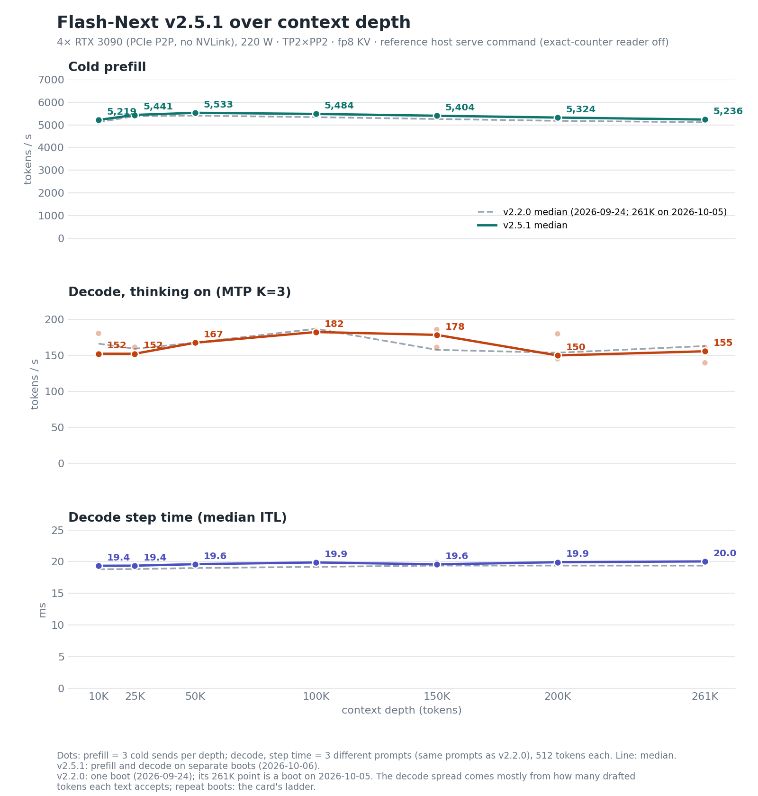

# Reference

The detail behind the [README](../README.md): what the build and serve scripts do, the container and Proxmox LXC
routes, health checks and troubleshooting, how the model is laid out on the four cards, capacity, known behaviours and
how the release is measured. Release notes are in [CHANGELOG.md](../CHANGELOG.md); earlier releases in full in
[history.md](history.md).

- [Overview](#overview)
- [Build and serve](#build-and-serve) (files, the bare-metal route, requirements, reproduction, running without
  peer-to-peer)
- [Container](#container) and [Proxmox LXC](#proxmox-lxc)
- [Check it's working](#check-its-working), [Troubleshooting](#troubleshooting)
- [Multi-GPU hosts and topology (opt-in)](#multi-gpu-hosts-and-topology-opt-in), [Running notes](#running-notes)
- [How it works](#how-it-works): [Hardware](#hardware), [The KV budget](#the-kv-budget),
  [Host-resident embeddings](#host-resident-embeddings-inside-the-cudagraph), [Stack](#stack),
  [Checkpoint](#checkpoint), [Serving an agent](#serving-an-agent)
- [Benchmarks](#benchmarks) (what each card measures, the evidence boundary, the quality metric)
- [Known behaviours](#known-behaviours-of-the-qwen38-flash-next-architecture-in-vllm)
- [What ships next](#what-ships-next), [Credit](#credit)

## Overview

Qwen3.8-Flash-Next (125B MoE, ~6B activated per token, plus a 51B n-gram embedding table and a one-layer MTP
head of about 2.6B parameters by the config's shapes; Gated DeltaNet linear attention, 512 experts, vision tower) served with vLLM
at its **full 262,144-token context** on four consumer Ampere cards: a **924,993-token** FP8 KV pool (3.53 full
262,144-token contexts; three full 262,144-token sessions measured resident at once on v2.5.1 with 0 preemptions), TP2 × PP2 + expert
parallel, MTP K=3. It is the daily model behind a
[hermes](https://github.com/NousResearch/hermes-agent) agent. The current release, **v2.5.1**, runs the public `v0.30.0`
tag plus 97 commits (58 from v2.2.0 and 39 for v2.5.1): agent follow-up turns resume from cache on a 64-token grid,
the KV pool is larger and prefill is faster than v2.2.0.

## Build and serve

**If you already have a vLLM checkout, do not start the server next to it.** vLLM inspects the model registry in a
child process started with `python -m`, which puts the current directory ahead of `PYTHONPATH` on `sys.path`. A
`vllm/` directory beside you therefore wins over the tree you built, and the failure surfaces much later as
something unrelated, typically `AttributeError: '_ModelInfo' object has no attribute ...`. `scripts/serve-v2.5.sh`
(and `serve-v2.sh`) refuse to start in that situation and tell you what to do; the container form cannot hit it at all.

| path | what |
|---|---|
| `upstream/PIN-v2.5` | **v2.5.1:** base commit (`v0.30.0`), bundle hash and branch, release commit and tree hash, the two own extensions' hashes, the stock 0.30.0 wheel (URL and hash), artefact tarball hash, runtime versions |
| `release/v2.5/patches/0001..0097` | the series over `v0.30.0`, for reading; linear, so `git am --keep-non-patch` on a fresh `v0.30.0` checkout (with `core.autocrlf=false`) replays it to the release tree. Only the tip was built and tested; the intermediate commits are a reading aid. Verified against `SHA256SUMS.v2.5.1` |
| `release/v2.5/v2.5.1-combined.diff` | one diff from `v0.30.0` to the release commit (212 files): `git apply --index` on `v0.30.0` gives the release tree |
| `release/v2.5/requirements-pinned.txt`, `build-artifacts.list`, `SHA256SUMS.v2.5.1`, `PACKAGE-MANIFEST.md` | the environment pins (196; transformers 5.18.0; the build tools pip / setuptools-rust / setuptools-scm are pinned in `upstream/PIN-v2.5`), the build-product paths, the hashes of the release assets, the combined diff and the 97 patches (`cd release/v2.5 && sha256sum -c --ignore-missing SHA256SUMS.v2.5.1`), the file manifest |
| `scripts/build-v2.5.sh` | fetch `v0.30.0` from GitHub + the bundle (release asset), check out, assert commit and tree, fresh venv from the pins, the first-serve toolchain links (`lib64` and the unversioned library names) in the venv's CUDA 13.0 wheels, then the compiled ops: the v2.2.0 artefact tarball (default, both own extensions hash-checked) or `BUILD_OWN=1` (stock wheel products + the two extensions compiled from the tree; needs cmake 3.26 or newer, ninja and a C/C++ compiler, and compiles with the venv's CUDA 13.0 nvcc unless `NVCC=` names another nvcc 13.0 or newer), metadata-only install. Relative paths are fine; a re-run resumes an interrupted source fetch or wheel download; every product file is hashed once verified (except `vllm/_version.py`, which the install regenerates; the build asserts the version instead), and a re-run re-checks the whole set |
| `scripts/serve-v2.5.sh` | the v2.5.1 served entry with every variable exported; same knobs as `serve-v2.2.sh` plus `--use-replayssm`, `--block-size 4096`, `--prefix-match-unit 64`, `VLLM_E2_SIDE_CACHE_LAYOUT=1`, `VLLM_E2_MAMBA_RETAIN_CHECKPOINT=1` and `VLLM_USE_V2_MODEL_RUNNER=1`; `GUARD` now defaults to `warn` in code as well; `COUNTERS` (default off; its FP8 KV clip reader starts after cudagraph capture), `CUDA_HOME` (default: the venv's CUDA 13.0 wheels); checks compiler, ninja, Python headers and nvcc-versus-driver and re-hashes the build products (as recorded by the build) before starting, warns when host RAM or `/dev/shm` is below the qualified sizes, and clears inherited fork knobs |
| `Dockerfile`, `docker-compose.yml`, `scripts/docker-entrypoint.sh` | the v2.5.1 container: `build-v2.5.sh` at image build (v2.5.1 bundle and unchanged v2.2.0 build-artifacts from their release URLs or the build context; gcc, g++ and ninja for the first serve, the base image's Python headers), `serve-v2.5.sh` as the entrypoint, checkpoint and cache as mounts, the config key added on first start if the mount is writable |
| `lxc/pve-create.sh`, `lxc/provision.sh`, `lxc/flash-next.service`, `lxc/nvidia-prestart.sh` | the Proxmox LXC form of the same thing: create the container with the device nodes and mounts, provision it (NVIDIA userspace, gcc/ninja/Python headers, `build-v2.5.sh`, config key, systemd unit), serve on boot; a pre-start hookscript that recreates the host's device nodes after a reboot |
| `scripts/make-e1-config.py` | adds the one config key to the published checkpoint, inside `text_config`, and re-parses the result to prove it landed where the engine reads it |
| `scales/qsa_kv_scales_262k.json`, `calib/` | the sidecar and how it was made (unchanged from v1) |

```bash
# v2.5.1. Release assets: v2.5.1-from-upstream-v0.30.0.bundle.gz (required),
# build-artifacts-sm86-py313-cu130-v2.2.0.tar.gz (unchanged compiled ops; or BUILD_OWN=1 to compile the two own extensions)
git clone --branch v2.5.1 https://github.com/halt95/qwen38-flash-next-3090s.git && cd qwen38-flash-next-3090s
R=https://github.com/halt95/qwen38-flash-next-3090s/releases/download/v2.5.1
curl -fLO "$R/v2.5.1-from-upstream-v0.30.0.bundle.gz"
curl -fLO "https://github.com/halt95/qwen38-flash-next-3090s/releases/download/v2.2.0/build-artifacts-sm86-py313-cu130-v2.2.0.tar.gz"      # 241 MB
hf download halt95/Qwen3.8-Flash-Next-W4A16-Merlin --local-dir /path/to/Qwen3.8-Flash-Next-W4A16-Merlin   # 115 GiB
gunzip v2.5.1-from-upstream-v0.30.0.bundle.gz
BUNDLE=./v2.5.1-from-upstream-v0.30.0.bundle ARTIFACTS=./build-artifacts-sm86-py313-cu130-v2.2.0.tar.gz \
  scripts/build-v2.5.sh ./vllm-v2.5 ./venv-v2.5
python3 scripts/make-e1-config.py /path/to/Qwen3.8-Flash-Next-W4A16-Merlin   # no-op if the config already carries the key
TREE=./vllm-v2.5 VENV=./venv-v2.5 CACHE_ROOT=./.vllm-cache-v2.5 HOST=0.0.0.0 scripts/serve-v2.5.sh /path/to/Qwen3.8-Flash-Next-W4A16-Merlin
```

Then [Check it's working](#check-its-working).

The v2.0.1 files (`upstream/PIN-v2`, `release/v2/`, `scripts/build-v2.sh`, `scripts/serve-v2.sh`), its build route and
the four deltas between its gate command and the shipped one are in
[docs/history.md](history.md#v201-build-and-serve).

`HOST=0.0.0.0` exposes an endpoint without an API key on every interface: if the host is reachable from other machines,
set `VLLM_API_KEY` (or pass `--api-key` after the checkpoint; extra arguments go to `vllm serve`), or keep the default
`127.0.0.1` behind a proxy.

**Requirements.** Linux x86-64 with glibc 2.34 or newer for the v2.5.1 build products (Ubuntu 22.04, Debian 12, RHEL 9 or
later); an NVIDIA driver with CUDA 13.0 or newer (the 580 series or later; tested on 595.84 / CUDA 13.2 and 610.43.02); git, curl; Python 3.13 with venv and
headers, as `python3.13` on `PATH`. Debian 13 packages it (`apt install python3.13-venv python3.13-dev`); Ubuntu
22.04 / 24.04 get it from the deadsnakes PPA (same package names); on Debian 12 or RHEL 9 use a standalone build such
as `uv python install 3.13` (it ships venv and headers; check that `python3.13` is on `PATH`), pyenv, or the
container. A C/C++ compiler and ninja (the first serve compiles kernels; `BUILD_OWN=1` also needs cmake 3.26 or newer,
which Debian 12's package is not: `pip install 'cmake>=3.26,<4'`; the tested build used 3.31, and 4.x is untested),
four visible 24 GB NVIDIA GPUs (qualified with peer-to-peer on the driver; it also runs without, see below), headless
and with no other CUDA process on them (the KV pool is pinned in bytes and leaves about 1 GB per card), host RAM
(96 GB qualified; ~69 GiB measured floor on v2.0.1/v2.2.0, not re-measured for v2.5.1), `/dev/shm` ≥ 1 GB. The first boot compiles the graphs (v2.0.1 ~10 min,
v2.2.0 ~6 min; a v2.5.0 release-candidate boot that compiled was ready in 5.5 min, a warm one in 2.3 min); later boots reuse `CACHE_ROOT`. (The reference host's qualification arms shared one compile cache; give production a
cache root dedicated to v2.5.1.) Reproduction from the release assets: a fresh clone of this repository (2026-10-06) with the v2.5.1 bundle verified all 99 checksums in `SHA256SUMS.v2.5.1`, built by the tarball route, confirmed commit `96a0d13b6e` and tree `0df6d7ef…` and transformers 5.18.0, and a second run of `build-v2.5.sh` changed nothing. For the v2.5.0 bundle (an earlier commit of this series; maintainer-run, 2026-10-04), a fresh clone of this repository built by the tarball route verified commit, tree and both own-extension hashes and installed transformers 5.18.0, and a re-run re-verified all 2,004 build-product hashes; the tests covering the v2.5.0 changes (1,196 across 32 files, CPU only) gave the same outcome per test on the published source as on the qualified tree (978 passed, 14 skipped; the same 204 fail or error on both: 185 need a CUDA device, the rest need gated Hugging Face models or a GPU platform's configuration, and one still expects upstream's CPU offload when only `VLLM_PLE_CPU_OFFLOAD=1` is set, which the v2.5 pull-transport default refuses by design). No GPU serve of the published package was run; the release-candidate runs served the qualified tree, which differs from the published one only as described in [Published source versus the qualified tree](../CHANGELOG.md#what-changed-in-v251). The published-package GPU serve off the reference host (below) was run for v2.2.0 only. The v2 reproduction is in [docs/history.md](history.md#v201-build-and-serve).

Outside the reference host (maintainer-run, 2026-09-24): on a rented 4× RTX 3090 without peer-to-peer (in a Debian 12
container: the Dockerfile's base image and apt line; driver 595.84 / CUDA 13.2), the published source built with `BUILD_OWN=1`
and served by `serve-v2.2.sh` with its defaults came up in 6 min on a fresh compile cache and 2.5 min on a warm one,
compiled FlashInfer's kernels on the first request, answered text, thinking, JSON-schema and a 54,713-token prompt
correctly, and gave the same T=0 output across three requests and two boots. The release tarball route (2026-09-25,
same host, one fresh-cache boot, up in 5.9 min; no warm-cache restart) passed the same request checks and gave the
same T=0 output as the `BUILD_OWN=1` tree.

**Without peer-to-peer** (a stock NVIDIA driver on consumer cards, as on that host; measured on v2.2.0, not repeated
for v2.5.1) the release ran unchanged: vLLM
turns its custom all-reduce off by itself and NCCL moves the tensor-parallel and pipeline traffic through host memory;
`serve-v2.5.sh` needs no edit. Expect lower prefill: a cold 54,713-token prompt took 13.8 s there (about 4,000 tok/s,
against 5,410 tok/s at 50K on the reference host), on a host that also had a PCIe x8 link per card and its cards split across
two NUMA nodes, so not all of the gap is peer-to-peer. Three 512-token decodes of a 24-token prompt took 3.6–4.0 s wall
each (127–141 tok/s including time to first token; not stream-timed, so not comparable with the bench card).

Read [Known behaviours](#known-behaviours-of-the-qwen38-flash-next-architecture-in-vllm) before putting it in front of clients.

## Container

The container recipe is one image that builds the pinned v2.5.1 tree and serves it (for v2.0.1, check out the `v2.0.1`
tag). **Unverified for v2.5.1:** the image has not been rebuilt or GPU-served on this release (its recipe changed only
in names and the bundle; for v2.2.0 the image was built and its entrypoint checks run on a host without GPUs). Use the
bare-metal route ([Build and serve](#build-and-serve)) for a verified install. Host requirements:

- four 24 GB Ampere cards (qualified with peer-to-peer working on the driver; it also runs without, with lower
  prefill, see [Build and serve](#build-and-serve)), headless, with no other CUDA process on them: the KV pool is
  pinned in bytes and leaves about 1 GB per card, so a display server or another process on one card can stop the
  boot (on a desktop, move the display to another GPU);
- `nvidia-container-toolkit` registered with Docker
  (`sudo nvidia-ctk runtime configure --runtime=docker && sudo systemctl restart docker`);
- Docker Compose v2 (`docker compose`, not the 1.x `docker-compose`);
- host RAM (96 GB is the qualified allocation; the measured resident floor is about 69 GiB on v2.0.1 and v2.2.0, not re-measured for v2.5.1, see [Hardware](#hardware));
- the checkpoint [halt95/Qwen3.8-Flash-Next-W4A16-Merlin](https://huggingface.co/halt95/Qwen3.8-Flash-Next-W4A16-Merlin)
  on disk (115 GiB).

```bash
git clone --branch v2.5.1 https://github.com/halt95/qwen38-flash-next-3090s.git && cd qwen38-flash-next-3090s
docker build -t qwen38-flash-next-3090s:v2.5.1 .      # fetches the v2.5.1 bundle + v2.2.0 build-artifacts asset; installs the first-serve toolchain
hf download halt95/Qwen3.8-Flash-Next-W4A16-Merlin --local-dir /path/to/Qwen3.8-Flash-Next-W4A16-Merlin   # 115 GiB; outside the clone (see below)
MODEL_DIR=/path/to/Qwen3.8-Flash-Next-W4A16-Merlin docker compose up -d
docker compose logs -f flash-next      # wait for "Application startup complete" (first start ~6 min)
curl -s localhost:8000/v1/chat/completions -H 'Content-Type: application/json'   -d '{"model":"flash-next","messages":[{"role":"user","content":"hello"}],"max_tokens":512}'
```

`hf` is the Hugging Face CLI: `pipx install huggingface_hub` or `uv tool install huggingface_hub` installs it
(a system-wide `pip install` is refused on current Debian and Ubuntu); after a bare-metal build, `./venv-v2.5/bin/hf`
also works. Download the checkpoint outside the clone, or keep it out of the Docker build context (`.dockerignore`
excludes a `Qwen3.8-Flash-Next-W4A16-Merlin*` directory). How to tell the server is healthy:
[Check it's working](#check-its-working).

The first start compiles the cudagraphs (about 6 minutes) into the `flash-next-cache-v2.5` volume, and the first request
compiles FlashInfer's kernels into the same volume (the image sets `FLASHINFER_WORKSPACE_BASE` and `TRITON_CACHE_DIR`
under `/cache`); later starts take about three minutes. Thinking is on by default, so a short `max_tokens` can end
inside the reasoning with empty `content`; send `"chat_template_kwargs":{"enable_thinking":false}` to turn it off per
request. The endpoint has no API key and the compose file publishes port 8000 on every interface: if the host is
reachable from other machines, set `VLLM_API_KEY` in its `environment` (clients then send
`Authorization: Bearer <key>`), or publish `127.0.0.1:8000:8000` behind a proxy. The host driver must support CUDA 13.0
or newer. The entrypoint adds the one config key the checkpoint needs if it is missing (see [Checkpoint](#checkpoint)).
Everything the container does is in `Dockerfile`, `docker-compose.yml` and `scripts/docker-entrypoint.sh`; the build
and serve scripts run without Docker ([Build and serve](#build-and-serve)).

## Proxmox LXC

**Proxmox instead of Docker.** The reference host runs this as a **privileged** Debian 13 LXC with the four cards passed
through as device nodes; `lxc/` reproduces that: `lxc/pve-create.sh` (run on the Proxmox host: template, cores, 96 GB,
the seven `/dev/nvidia*` nodes, checkpoint and cache mounts), `lxc/provision.sh` (run inside: NVIDIA userspace matching the
host module, the pinned build, the config key, a systemd unit) and `lxc/flash-next.service`.

Two things about the LXC route are easy to get wrong. The container is privileged on purpose: in an unprivileged one
root is mapped to a high uid and `/dev/nvidia-uvm-tools` is `0660 root:root`, so the container cannot open it even
though the cgroup rule allows the device. And the `/dev/nvidia*` nodes must already exist **on the Proxmox host**
before the container starts, because the kernel module lives there and only its userspace goes inside; running
`nvidia-smi -L` once as root creates the full set, while `nvidia-modprobe -u -c0` alone leaves out the uvm nodes.
Neither survives a host reboot on its own, so the container needs a Proxmox pre-start hookscript that creates the
nodes before it starts. `lxc/nvidia-prestart.sh` is a minimal one: install it into a snippets storage on the host and
attach it with `pct set <CTID> --hookscript local:snippets/nvidia-prestart.sh` (below; the storage needs the
Snippets content type enabled).

```bash
git clone --branch v2.5.1 https://github.com/halt95/qwen38-flash-next-3090s.git && cd qwen38-flash-next-3090s   # on the Proxmox host
hf download halt95/Qwen3.8-Flash-Next-W4A16-Merlin --local-dir /path/to/models/Qwen3.8-Flash-Next-W4A16-Merlin   # 115 GiB; the CT sees it at /models/Qwen3.8-Flash-Next-W4A16-Merlin
CTID=201 MODELS=/path/to/models STORAGE=local-lvm lxc/pve-create.sh   # STORAGE: your rootfs storage (pvesm status), e.g. local-zfs
install -m 0755 lxc/nvidia-prestart.sh /var/lib/vz/snippets/nvidia-prestart.sh && pct set 201 --hookscript local:snippets/nvidia-prestart.sh
pct start 201 && pct push 201 lxc/provision.sh /root/provision.sh
pct exec 201 -- env NVIDIA_RUN=/models/NVIDIA-Linux-x86_64-<host version>.run bash /root/provision.sh
```

The one input the recipe cannot ship is the NVIDIA userspace, which must match the kernel module the Proxmox host runs:
`nvidia-smi` on the host prints the version; download that `NVIDIA-Linux-x86_64-<version>.run` from NVIDIA's driver
archive and put it under the directory you set in `MODELS` (mounted at `/models` inside the container) before the
provisioning step. It is installed with `--no-kernel-module`; peer-to-peer itself is a host property. The host driver
must support CUDA 13.0 or newer (the 580 series or later). `provision.sh` checks for the checkpoint right after
`nvidia-smi -L`, before the build, and ends by printing the check in [Check it's working](#check-its-working).

## Check it's working

The same check applies to all three routes (container, Proxmox LXC, bare metal):

```bash
# 1. the log shows "Application startup complete" (first boot ~6 min on a fresh compile cache, later boots ~3 min)
# 2. the log's KV line reads "GPU KV cache size: 924,993 tokens" with the default serve command (the pool is pinned in bytes, so any other
#    number means the serve command or the build is not the shipped one)
# 3. a real generation answers (add -H "Authorization: Bearer <key>" if you set VLLM_API_KEY):
curl -s localhost:8000/v1/chat/completions -H 'Content-Type: application/json' \
  -d '{"model":"flash-next","messages":[{"role":"user","content":"ok"}],"max_tokens":16,"chat_template_kwargs":{"enable_thinking":false}}'
```

The first request also compiles FlashInfer's kernels, so it takes noticeably longer than later ones (not measured).
Do not use `/v1/models` as a health check: it answers 200 even when the engine is dead. The container's
`HEALTHCHECK` runs a one-token generation for that reason.

The v2.5.1 cache fixes each log one line at startup; all four should be there:
`Mamba align: each request holds its partial-tail CoW checkpoint until it is freed (...)`,
`Mamba align: a prompt tail key that lands on a block end is hashed too (...)`,
`Prefix cache: waiting requests' cached prefixes are pinned until admission (...)` and
`Prefix cache: a finished turn's cached prefix stays referenced until its next turn is admitted (...)`.

## Troubleshooting

- `Bus error` at boot: `/dev/shm` is under 1 GB (`docker run --shm-size=8g`; the compose file sets `shm_size: 8g`).
- CUDA out-of-memory or a free-memory refusal at boot on one card: a display server or another process holds memory
  on it (`nvidia-smi`); free the card. As a last resort a lower KV pin after the checkpoint, e.g.
  `--kv-cache-memory 3800000000` (extra arguments go to `vllm serve`, and the last value wins), boots with a smaller
  pool; that configuration is not qualified.
- The model load is killed by the kernel's OOM killer with nothing useful in the vLLM log: host RAM is below the
  ~69 GiB resident floor ([Hardware](#hardware)); `serve-v2.5.sh` warns at start.
- `AttributeError: '_ModelInfo' object has no attribute ...`: a `vllm/` directory in the working directory shadows
  the build (see the note above the [Build and serve](#build-and-serve) table); `serve-v2.5.sh` refuses to start there.
- `Unsupported .version` from PTX on the first request: the nvcc that compiles the first-serve kernels is newer than
  the driver's CUDA; keep the default `CUDA_HOME` (the venv's CUDA 13.0 wheels) or point it at a toolkit no newer than
  the driver.
- `RuntimeError: e2-guard[...]` at boot: the compile profile was changed (`--enforce-eager`, another
  `cudagraph_mode`, breakable graphs); this build serves only the qualified shape, by design.
- `Custom allreduce is disabled because your platform lacks GPU P2P capability ...`: expected on a host without
  peer-to-peer ([Without peer-to-peer](#build-and-serve), above).
- `pct start` fails on a missing `/dev/nvidia-uvm`: the device nodes were not created on the Proxmox host after a
  reboot; run `nvidia-smi -L` on the host, and attach `lxc/nvidia-prestart.sh` as the container's hookscript.
- `/v1/models` answers but completions fail or never return: the engine has died; read the log from the first named
  cause (a bounds-guard, PLE fail-closed or worker-exit line).
- Empty `content` with `finish_reason: "length"`: thinking is on and `max_tokens` ended inside the reasoning; raise
  `max_tokens` or send `"chat_template_kwargs":{"enable_thinking":false}`.
- Empty completion with `finish_reason: "stop"` and zero tokens: a
  [known behaviour](#known-behaviours-of-the-qwen38-flash-next-architecture-in-vllm); retry once.

## Multi-GPU hosts and topology (opt-in)

By default `serve-v2.5.sh` uses the settings the release was qualified with: GPUs 0-3 in PCI bus order, vLLM's P2P
check skipped, `NCCL_P2P_LEVEL=SYS`, `NCCL_PROTO=LL`. On a host that does not look like the reference one, set
`AUTO_TOPO=1`: serve then runs `scripts/topo_select.py`, which reads the GPU topology from NVML and `/sys` and sets the
GPU order and the P2P and NCCL variables from it, falling back to the fixed settings on any doubt.

- **NVLink pairs**: the selector reorders the four GPUs so that each NVLink-bridged pair is a tensor-parallel pair,
  even when the bridged cards are not next to each other in bus order. This rule is derived from the topology NVML
  reports and covered by unit tests on a synthetic bridged topology; it has not been run on NVLink-bridged hardware.
- **More than four GPUs**: pick four by UUID (`nvidia-smi -L`), ideally on one NUMA node,
  `CUDA_VISIBLE_DEVICES=GPU-aaaa...,GPU-bbbb...,GPU-cccc...,GPU-dddd...`. UUIDs do not depend on enumeration order.
  This works with the selector off too; with `AUTO_TOPO=1` it also checks the order and the P2P settings.


[docs/topology-selector.md](topology-selector.md) has the decision rules, `AUTO_TOPO=strict` and the other controls.

## Running notes

Lines every boot logs that are not failures: `PLE offload CUDA guard: blocked a CUDA initialization attempt` with a
call-site traceback (through FlashInfer's import) and `Failed to get device capability: CUDA is disabled in the PLE
offload process` (the offload process refuses a CUDA context by design), NCCL's `unbatched P2P op` warnings and
Triton's `JIT compilation during inference` warnings. On a host without peer-to-peer, also vLLM's `Custom allreduce is
disabled because your platform lacks GPU P2P capability` warning.

Never reuse an existing venv for this tree, and do not set `PYTORCH_CUDA_ALLOC_CONF=expandable_segments`
(v1 measured it at −27 % four-stream aggregate).

Process model: the workers set `PR_SET_PDEATHSIG(SIGKILL)` so an engine-core death takes them with it, and start
methods other than fork and spawn are refused. The death signal fires when the *thread* that spawned the workers exits, so an embedded
engine must build its executor from a thread that outlives serving (the `vllm serve` path does). The
upstream MTP-under-PP change (#46994) is in the `v0.30.0` base; the series applies its stage-ownership pattern to
this model's code, without upstream's tests.

Allocator warnings you may see: with several long sessions growing at once, the log can show
`CUDACachingAllocator ... memory allocation failed with OOM on device N while trying to allocate <70–270 MB>` lines.
They are warnings, not failures: the upstream sparse-attention indexer's prefill logits buffer (256 rows × context
length × fp32, so 1 KiB per token of context, 268 MB at 262K) asked for a contiguous block the caching allocator
could not find, the allocator flushed its cache and the retry succeeded. Maintainer-observed on the reference host (no shipped record) with three
sessions climbing from 50K to 170K tokens: 22 lines, no request failed, device free dipped to 18–34 MB at the
moment of the warning, and the lines stopped once the cache had been flushed at each size. If a retry ever fails, that is
the non-KV headroom (about 1 GB per card at the shipped pin) being exhausted, and the KV pin is the knob.

## How it works


### Hardware

| resource | reference host |
|---|---|
| GPU | 4× NVIDIA GeForce RTX 3090 (Ampere sm_86, 24 GB each), **220 W** power cap, no NVLink |
| PCIe | Gen4 x16 to every card; P2P over the aikitoria open-kernel-module patch (`VLLM_SKIP_P2P_CHECK=1`, `NCCL_P2P_LEVEL=SYS`) |
| CPU / RAM | AMD EPYC 7532, 192 GB ECC; the serving container is allocated **96 GB**, the qualified figure. Measured resident floor on the v2.0.1 container: about **69 GiB** = the ~48 GiB FP8 n-gram table (anonymous memory in the offload process) + ~4.2 GiB of pinned embedding tables (1,064 MiB per rank) + ~8 GiB of shared segments + ~8 GiB across the four workers, engine core and API server; the remaining ~26 GiB up to the 96 GiB limit (98,304 MiB, what the recipes call "96 GB") is checkpoint page cache and reclaimable. The boot peak was not measured, so treat the 69 GiB floor as a hard floor (below it the load OOMs), 80 GB as the sensible minimum and 64 GB as not enough |
| disk, `/dev/shm` | ≥ 250 GB free (the checkpoint is 115 GiB); `/dev/shm` ≥ 1 GB (maintainer-measured peak +30.6 MB per boot; a `Bus error` at boot means it is undersized) |
| OS / serving | Linux container on Proxmox; the scripts here run the same engine |

### The KV budget

**924,993 tokens** at `--kv-cache-memory 4100000000` per rank, measured on every v2.5.1 boot. The
attention block size is 4,096 tokens (`--block-size 4096`; the computed default would be 3,392). The per-request limit stays 262,144; the pool is the aggregate over concurrent requests. Where the room came from
relative to TP4 at the same weights (the layout diagram under [How it works](#how-it-works) shows where each piece sits):

- **PP2 halves what each card duplicates.** With tensor parallel alone every card holds a slice of every
  layer plus the whole non-sharded state; with two pipeline stages each pair of cards holds 25 / 23 of the 48
  layers. The stage-0 pair keeps the vision tower and the target embedding, the stage-1 pair the MTP drafter and
  the LM head, each built once instead of on all four (0.59 GiB per copy at TP2).
- **The 51B n-gram (PLE) table is host-mapped.** The FP8 table stays in host RAM; a pull transport gives the
  GPUs the rows they need per step through a pinned slot, with a fail-closed ownership protocol (a transport
  fault kills the engine with a named cause rather than serving stale rows). The policy is wider than the transport:
  on a PLE boot, any exception that escapes a worker's model step or sampling hard-kills that worker (`os._exit(1)`
  with the cause on stderr) and its peers stop at the NCCL watchdog, where upstream would surface an engine error
  and keep the process. The offload process keeps itself CUDA-free by patching torch internals
  (`torch.cuda._lazy_init`, `torch.cuda.Stream.__new__`, `torch.Tensor.pin_memory`); a torch upgrade could disable
  that guard silently, which is one more reason the pins are pins. Its cost is decode-neutral in the
  card; its price was most of the engineering of the work.
- **Token embeddings in pinned host memory** (`VLLM_HOST_EMBED_TABLE=1`, [our design, below](#host-resident-embeddings-inside-the-cudagraph)):
  608 MiB of device memory freed per rank, the lever that lifted the pin from 3.8e9 (pool 748,255)
  to 4.1e9 (pool 806,792).
- **Side-cache layout (v2.5).** The PLE state folds into a GDN cache group and the QSA rings pack into shared
  slots. Together with RecoverSSM state recovery this lifts the pool at the same 4.1e9 pin from 806,792 to 929,987
  tokens at the computed 3,392-token block, and to 924,993 at the shipped 4,096-token block, which prefills faster; the
  layout alone measured 806,792 -> 853,994 in its own commit.
- The 4.1e9 pin was the highest that booted with a complete clean row set on v2 (measured on its qualification boots;
  24/24 layer partitions and higher pins failed on the tightest card; 3.8e9 was the ceiling before the host-resident
  embeddings). v2.5.1 keeps the pin; higher pins were not re-tested.

Six 131K sessions (v2.2.0: five) and three full 262,144-token sessions were each measured resident at once on v2.5.1
with 0 preemptions (the v2 gate held three at 302 of 317 blocks). Under full-pool pressure, 8 deep conversations drove
the pool to 99.2 % with 2 preemptions, and all 107 requests completed. Session
token totals overstate capacity because each running session also holds fixed GDN state blocks; without MTP the pool
is 1,057,314 tokens (computed attention block, not block 4,096), with three 262K or seven 131K sessions measured resident at once (v2.5.0's release candidate).

### Host-resident embeddings inside the cudagraph

This is the v2 change that is ours end to end (patches `0037` and `0039` in `release/v2/patches/`). The engine holds two bf16 copies of the
248,320 × 2,560 token-embedding table: the target's on stage 0 and the MTP drafter's on stage 1 (the same weights;
the checkpoint ships one table, and the drafter has no embedding of its own); sharded over TP2 that is 0.59 GiB per
copy per card, and at TP4 the copies were part of what capped the pool. v2 keeps both copies in **pinned host memory** and
gives each rank a **device-mapped (UVA) lookup** over its shard: the same TP sharding, id masking and all-reduce as
the device path, invalid ids yield zero rows, and the output is **bytewise identical** to the device table, signed
zeros included (tests: real shard loader with no CUDA transient, TP2 bytewise masking + reduction, GPU capture and
replay with three lookups in one graph).

Why the obvious version does not work: the drafter's lookup sits **inside the FULL cudagraph of the draft step**, so a
CPU-side gather (the first draft) cannot run there and was rejected in review; the lookup has to be a device
operation over host-mapped memory that the graph can replay. The cost is a 1,064 MiB host allocation per rank
(maintainer-measured) and a PCIe read per looked-up row; the card shows no decode penalty against the TP4 lane. It is
on by default (`VLLM_HOST_EMBED_TABLE=1`) and can be turned off, which costs the 608 MiB per card back. One consequence
worth knowing if you build from source: the flag is a torch compile-cache factor (the UVA and device drafter graphs
must not share an AOT cache entry; patch `release/v2/patches/0068` registers it, and a pre-fix tree needs separate `VLLM_CACHE_ROOT`s per
mode).

### Stack

| piece | v2.5.1 |
|---|---|
| vLLM | public tag **`v0.30.0`** (`ced6857afa`) + 97 commits (58 from v2.2.0 and 39 for v2.5.1), release commit **`96a0d13b6e`** (tree `0df6d7ef…`, head of the bundle's branch `v2.5.1-public`; `release/v2.5/patches/`, a linear series that replays with `git am`; build from the bundle); `release/v2.5/v2.5.1-combined.diff` is the same delta as one applyable diff |
| compiled ops | the v2.2.0 compiled-ops tarball is reused unchanged because the 39 commits after v2.2.0 change no compiled code (Python, plus comment-only edits in three C/CUDA files; no CMake or build file) (`_C_stable_libtorch` `6cb8bc77…`, `_moe_C_stable_libtorch` `66acb123…`); `BUILD_OWN=1` compiles both extensions from the tree. The 2,005 build products (2,004 hash-checked; the install regenerates `vllm/_version.py`) ship in the v2.2.0 tarball; both routes are hash-pinned in `upstream/PIN-v2.5` |
| environment | Python 3.13, torch 2.13.0 (CUDA 13.0), triton 3.7.1, flashinfer 0.6.18.post1, 196 pins in `release/v2.5/requirements-pinned.txt` (transformers 5.18.0); CUDA runtime from the venv wheels; the first serve compiles FlashInfer and Triton kernels with the pinned CUDA 13.0 nvcc wheels plus a system C/C++ compiler, ninja and the Python 3.13 headers; driver CUDA ≥ 13.0 |
| shape | as v2.0.1: TP2 × PP2 + EP, `VLLM_PP_LAYER_PARTITION=25,23`, MTP K=3 probabilistic, FULL_AND_PIECEWISE cudagraphs with captures to 32, `max-num-seqs 8`, prefill chunk 1,024, KV pin 4.1e9, fp8_e4m3 KV with the sidecar, prefix caching, `NCCL_PROTO=LL`, `--shutdown-timeout 60`; plus `VLLM_USE_BREAKABLE_CUDAGRAPH=0`, `--use-replayssm`, `--block-size 4096`, `--prefix-match-unit 64`, `VLLM_E2_SIDE_CACHE_LAYOUT=1`, `VLLM_E2_MAMBA_RETAIN_CHECKPOINT=1`, `VLLM_USE_V2_MODEL_RUNNER=1`, image limit 42 with 4 MP per image |
| PLE table | host-mapped pull transport, home GPU 0, fail-closed (`VLLM_E2_PLE_PULL_TRANSPORT=1`, `VLLM_PLE_OFFLOAD_HOME_DEVICE=0`; unset pull transport defaults to 1) |
| embeddings | pinned host tables on both stages (`VLLM_HOST_EMBED_TABLE=1`) |
| determinism | `MERLIN_FULL_K`, `MERLIN_QSA_SORT`, `MERLIN_TIE_DET`, `MERLIN_TIE_RECENT`, `MERLIN_TOPK_SORTED_EMIT` = 1 by default when unset (`=0` opts out for direct engine use; the launcher sets 1) |
| instrumentation | bounds guards on in `warn`; exact-restart and FP8 KV clip counters off by default (logging only; `COUNTERS=1` turns them on; the FP8 KV clip counter reader starts after cudagraph capture) |

The v2.0.1 stack is in [docs/history.md](history.md#v201-stack).

### Checkpoint

The same checkpoint as v1, [halt95/Qwen3.8-Flash-Next-W4A16-Merlin](https://huggingface.co/halt95/Qwen3.8-Flash-Next-W4A16-Merlin)
(Intel AutoRound INT4 g128 experts, the RadixArk FP8 n-gram table, MTP draft experts INT4 and GDN projections
INT8 packed in place, attention BF16; lineage in its model card), **plus one config key**: v2 keys the FP8
n-gram table on `ple_embedding_dtype: float8_e4m3fn` inside the `text_config` object of `config.json` (the engine reads
its text config, so a top-level key does nothing) instead of the `VLLM_PLE_FP8_GLOBAL_SCALE` environment variable v1
used (v2.0.x still honours that opt-in for a checkpoint without the key; v2.2.0 and later do not, and `serve-v2.5.sh` refuses
to start without the key). The checkpoint on Hugging Face carries the key since 2026-09-18; for a download that
predates it, `scripts/make-e1-config.py` adds it (and is a no-op otherwise); every weight file stays byte-identical.
Shard hashes are not
published here; the Hugging Face checkpoint carries them, and the v2 delta is the one config key above.

The KV scale sidecar is **the file v1 shipped**, `scales/qsa_kv_scales_262k.json` (calibrated on the reference host, margin
1.10, sha256 `5cbe6ae8…`); the reference host serves the same bytes under a different file name. One file ships.

### Serving an agent

| agent need | as served |
|---|---|
| several long sessions at once | 8 sequences admitted; 3 × 262K, 1 × 262K + 3 × 131K, 5 × 131K, 8 × 65K and 8 × 32K all resident (v2 gate); v2.5.1: six 131K and three 262K sessions each measured resident at once, 0 preemptions |
| the same context re-sent every turn | prefix caching on; a follow-up turn resumes from its conversation's cached prefix on a 64-token grid, and v2.5.1 holds that prefix until the next turn is admitted ([What changed in v2.5.1](../CHANGELOG.md#what-changed-in-v251)) |
| tool calls, thinking, images | Qwen3 coder tool parser, Qwen3 reasoning parser with thinking on at low effort, up to 42 images per request capped at 4 MP each, one OpenAI-compatible front door |
| a client that expects an answer every time | retry once on `finish_reason == "stop"` with 0 completion tokens ([empty warm completion](#known-behaviours-of-the-qwen38-flash-next-architecture-in-vllm)) |
| not dying at depth | 14-cut fault campaign on the transport (fail-closed on every cut), stress sequence, memory profiles with three 262K sessions plus a burst, prefix-cache correctness under forced preemption (51/51 answers correct), all maintainer-run |

## Benchmarks

The v2.5.1 card: [`benchmarks/2026-10-06/BENCH-CARD.md`](../benchmarks/2026-10-06/BENCH-CARD.md): the decode ladder against v2.2.0 over repeat boots (−2.87 %, 95 % CI −6.84 % to +1.09 %, 2 v2.5.1 boots versus 7 reference boots; v2.5.0's release candidate: −2.81 % with 4 boots), aggregate and multi-turn results, follow-up turns against v2.5.0, capacity, the depth chart (cold prefill 1.0–2.8 % above v2.2.0; decode step time 19.4–20.0 ms) and cache validity. Greedy repeatability at depth and fault containment were not re-run; their release-candidate results are in the v2.5.0 card, [`benchmarks/2026-10-05/BENCH-CARD_OLD.md`](../benchmarks/2026-10-05/BENCH-CARD_OLD.md).



v2.2.0 against the v2 gate medians, single-stream decode (one boot of the release candidate; per-cell numbers in
[`benchmarks/2026-09-24/BENCH-CARD.md`](../benchmarks/2026-09-24/BENCH-CARD.md)): 0.973–1.040 of v2 in every cell,
one v2.2.0 boot against the five-boot medians, no confidence interval claimed.

> **Evidence boundary.** The v2.2.0 card ([`benchmarks/2026-09-24/BENCH-CARD.md`](../benchmarks/2026-09-24/BENCH-CARD.md)) is a
> maintainer measurement like the others; its qualification and fault records are not published. The v2 card is a
> maintainer measurement on the reference host with a frozen, hash-pinned manifest; the bench card is published, the
> underlying close records, raw streams and boot logs are not (as for v1). The v2.0.1 requalification figures are
> maintainer-reported and their record is not published; the two upstream pull requests the fix ports are public and
> can be read independently. What you can reproduce independently: the source tree (commit **and** tree hash, from the
> public upstream commit plus the bundle shipped as a release asset), the environment (196 pinned packages for v2.5.1 and v2.2.0,
> 199 for v2.0.1), the sidecar, and the serve command. Everything else is maintainer-reported.

The v2 gate ran **five boots per arm, alternating v2 and v1 on the same box**, one frozen manifest, three sends
per cell, judged as medians with a 0.97 rule per depth and a 0.90 floor per boot. Full card with every boot's
numbers, the event intervals, tokens per step, the fingerprint and the environment:
[`benchmarks/2026-09-17/BENCH-CARD.md`](../benchmarks/2026-09-17/BENCH-CARD.md).

| cell | verdict |
|---|---|
| decode, thinking on, 4K / 32K / 131K | 0.997 / 1.009 / 0.988 of v1 — **PASS** at every depth |
| decode, thinking off, 32K / 131K | 1.008 / 1.024 — PASS |
| decode, thinking off, **4K** | **0.952 — FAIL against the 0.97 rule**, shipped documented (a draft-acceptance effect of the shape, not a v2 patch: it is identical with the readers on or off): event interval identical (18.66 vs 18.64 ms), tokens per step 2.14–2.31 vs 2.31, clustered per boot; cause not established then (a 2026-09-23 re-test on the v2.2 release candidate found the cell at parity, consistent with a content draw; Known behaviours) |
| prefill 10K / 100K | +10 % / +26 % — PASS |
| quality vs teacher | delta −0.0009, well inside the 0.0015 bound — PASS (metric below). (An earlier single-capture quality screen recorded **FAIL** and stays cited as such; the two-arm gate replaced it as the instrument) |
| pool, capacity, tools, no-think, faults | PASS (see card) |

**The quality metric ("divergence from the BF16 teacher").** The teacher is a reference run of this same checkpoint
with a BF16 KV cache, eager and without speculative decoding, captured once on 24 held-out prompts. Each served boot
is scored teacher-forced on the teacher's own continuations: the metric is the mean absolute difference in per-token
log-probability over all 1,476 positions of the 24 prompts (lower is closer), averaged over 4 captures per boot. It
therefore measures what the serving configuration (FP8 KV cache, compiled graphs, parallel layout, engine patches)
adds, not the loss from quantising the original model. In the v2 gate, "delta" is the mean v2 boot minus the mean v1
boot, and it passed if U, the one-sided 95 % upper bound of that delta (Welch), stayed at or below 0.0015, one
within-boot standard deviation of the reference captures, fixed in advance.

What the earlier candidates looked like: with the two instrumentation reader threads on and the default
NCCL protocol, the thinking-on rows sat at 0.949 / 0.962 of v1 (event interval 19.10 vs 18.56 ms at 4K). The
readers (a bounds-guard telemetry reader and the KV clip counter, each polling every 50 ms) cost ~0.3–0.5 ms
per step on the pipeline's critical path; v2 ships them off and `NCCL_PROTO=LL` on, which is the whole
difference (maintainer-measured).

## Known behaviours of the Qwen3.8-Flash-Next architecture in vLLM

These are behaviours of the Qwen3.8-Flash-Next serving path in vLLM (the hybrid Gated-DeltaNet / sparse-attention /
MTP execution path and its hybrid KV manager). None is introduced by this checkpoint's quantisation. The empty warm
completion is an upstream-reported class and was seen on the v1 TP4 lane; the ring-row death is in upstream code. The
prefix-cache loss did not move across the five release candidates (v2.0.1 included) when the v2 deltas were bisected,
but whether it is upstream's or the patches' is **not established**: a run on the unmodified upstream base is still
owed. v2 documents them, ships mitigations where one exists, and tracks them; none affects the correctness of answers
in the gate.

- **Shared-prefix over-report with deferred block release (v2.5.1, not reached by the shipped configuration).** With
  pipeline parallelism, blocks whose release is deferred can make the shared-prefix shortcut over-report a common
  prefix; only cascade attention on the V1 runner consumes it, and the shipped configuration uses the V2 runner with
  cascade attention off.
- **Custom pool sizes: keep the KV pool larger than `--max-model-len` plus a few blocks** (not reached with the
  shipped settings: a 924,993-token pool, requests up to 262,144 tokens). If you shrink the pool so that one request
  needs nearly all of it, that request, holding a partial cached prefix, can wait indefinitely: the cached prefix costs
  more blocks than the pool has left.
- **Empty warm completion — an occasional empty completion on a warm repeat of a long cached prefix** (upstream class:
  vllm-project/vllm #53912, prefix caching + speculative decoding on hybrid models; seen on the v1 TP4 lane too). HTTP 200,
  `finish_reason: "stop"`, zero tokens: the first sampled token is EOS. Per boot, not per request (roughly one
  boot in three on the no-MTP diagnostic shape; three empty warm completions in 23 gate boots of two earlier release
  candidates, two of them on the v1 TP4 arm; none in the 10 boots of the final run; on the v2.2 release candidate, 0 of
  200 warm requests over 5 boots without preemption, a request-level 95 % upper bound of 1.88 % (Wilson score) that says nothing about
  boot-level incidence). The cached bytes are proven identical between a call that flips and
  the calls around it; the race is inside the flipping request's own forward, it needs pipeline parallel plus
  async scheduling, and async scheduling is required with MTP under PP on this fork. Mitigation shipped: **retry
  once**; it returned the correct answer in every observed case (a mitigation, not a guarantee; the rate on the
  served profile is not measured). Maintainer-reported.
- **Prefix-cache loss — prefix-cache blocks of sessions that finish while other long sessions are still decoding are dropped**
  (in the hybrid KV manager path; upstream or patch origin not established). Not preemption (reproduced with zero
  preemptions). The variable that separates the arms is the survivors' remaining decode: with 320-token outputs only
  the first-finished session loses its blocks, with 2,048-token outputs every session does, and a single long session
  plus a burst retains everything. Free-block state during the episode was not sampled, so eviction under pool
  pressure is not excluded. Reproduced on three release candidates (one boot each, one shared compile cache); one boot
  of a fourth kept the last-finished session; re-run on v2.0.1 with an identical failing set, identical cache-hit
  total and 51/51 answers correct. Cost: first-token latency on that session's next turn; the answer is unaffected.
  v2.5 fixes related multi-turn losses: a running request's GDN prefix checkpoint could be evicted before it
  finished, and v2.5.1 holds a finished turn's prefix until its conversation's next turn is admitted
  ([What changed in v2.5.1](../CHANGELOG.md#what-changed-in-v251)). Whether these also account for this pattern (sessions that end
  while others decode) has not been re-tested on v2.5.1.
- **Thinking-off decode at 4K** is 0.92–0.99 of the TP4 lane on every one of the five boots, four of them below the
  gate's 0.97 rule (above); it is the one cell that makes the gate's automatic verdict for the run FAIL. A later
  interleaved re-test (2026-09-23; 15 boots: the v1 TP4 lane, and the v2.2 release candidate with the determinism
  switches on and off, five each) put the cell at 1.011 of v1 with the switches on (0.987 off), with tokens per step
  equal (1.007 [0.994, 1.021]). That is consistent with the September shortfall being a content draw (at T=0 a
  near-tie at the first prose tokens picks one of a few equally valid phrasings, and they differ in how well the
  drafter predicts them) rather than an acceptance defect of the engine; the v2 shortfall itself was not re-run.
- **A rare illegal-address engine death** (upstream sparse-attention code path; two occurrences over the whole development;
  mechanism: a re-claimed, never-zeroed ring row read as a RoPE position). Bounds guards turn a recurrence into a
  named, counted failure when their reader is on; before v2.5 the reader was **off by default** in code, so a masked
  fault at an always-fatal site was counted but never read or raised unless `GUARD=warn` was set (the served
  profile always set it). Since v2.5 the code default is `warn` as well; `GUARD=off` turns the reader off. Not fixed
  in v2.0.x; no rate is claimed. **Contained in v2.2.0**: ring rows are tagged and validated before
  pooling, and with the served profile's `GUARD=warn` a mismatched row stops the engine with a named cause instead of
  faulting (see [What changed in v2.2.0](history.md#what-changed-in-v220)); the fault is not proven absent.
- **Greedy T=0 is not byte-reproducible** on v2.0.x with this architecture (bf16 near-ties resolved differently by the
  sparse indexer's top-k and the expert permutation); documented, accepted. **v2.2.0** makes it repeatable **within one
  compile cache** (the determinism switches). Two fresh compiles of the identical tree and environment can still give
  different T=0 outputs: the six FLA gated-delta-rule chunk kernels (prefill only) carry their own Triton autotune, and
  their near-tied picks are cached per compile directory (14 to 18 of 24 picks differed between two fresh caches). If
  byte-identical repeats matter, keep one `VLLM_CACHE_ROOT` per deployment. Inductor's own reduction autotuning is a
  second candidate source; which kernels account for the difference is not fully attributed, so a v2.2.x fix will be
  validated by fresh-cache equality, not assumed from pinning one of them. Any numeric change (layout, kernel build,
  version) can also flip near-tied choices: TP2 × PP2 and TP4 gave byte-identical output for 0 of 22 prompts, differing
  in phrasing, not correctness, and MTP acceptance moves with the text by a few percent per prompt.
- Fixed on the way and worth knowing if you run an older candidate: a worker hang at the end of very long
  prefills (the instrumentation readers deadlocking under the CUDA context lock; fixed before v2, readers off
  in v2) and the upstream Mamba admission-estimate regression (#57050, ported before v2).

## What ships next

v2.5.x: the host-RAM KV tier, and making greedy output repeat across fresh compiles (the FLA chunk kernels' and
Inductor's autotuning, validated by fresh-cache equality). Still open from v2: the finished-session prefix-cache
loss (the hybrid KV manager's free path under concurrent decode; not re-tested on v2.5.1), the empty-completion racing
pair (stream-fence / cloned-relay / all-gather interventions and a consumption-time generation check, plus upstream
#43650 and #53919), and the packers / converter / deep-context harness that produce the checkpoint.

## Credit

- Model: [Qwen/Qwen3.8-Flash-Next](https://huggingface.co/Qwen/Qwen3.8-Flash-Next)
- vLLM model support and PLE offload: the [`peakcrosser7` Flash-Next branch](https://github.com/peakcrosser7/vllm/commits/release/qwen38next_offload)
  behind vLLM PRs [#53896](https://github.com/vllm-project/vllm/pull/53896) and [#53899](https://github.com/vllm-project/vllm/pull/53899)
  (#53899 was closed without merging; upstream took a UVA PLE offload instead, [#54371](https://github.com/vllm-project/vllm/pull/54371), which is in `v0.30.0`);
  in the v2.0.1 base commit and re-ported since v2.2.0: PRs #54793 / #54795 (saichowdary007, open upstream); carried ahead of the base as the five
  upstream-authored patches: the prefix-cache chain #53614 #55747 #53945 #54713 #55450 (ZeldaHuang, yewentao256, akshaver,
  tobymao, lucamotz); ported by us: #55745, #57050 (merged upstream) and the #54442 / #56802 pair
  ([v2.0.1](history.md#what-changed-in-v201)); upstream issue #54709 is the PP>1 refusal for PLE checkpoints that
  this tree works around. v2.2.0 is built on the public vLLM `v0.30.0` release, which carries the Flash-Next model
  support upstream (including #46994, eastwood-c, whose stage-ownership pattern the delta applies to this model); its
  delta re-ports #48532 (woosebastian), #50021 (amittell), #54442
  (ArcheyChen) / #56802 (Prudctual), #55506 (Karl0007), #55557 (semerandre) and #57050 (wzhao18), credited by PR
  number in the commit messages and by author here and in `NOTICE`; v2.5.1 adds ten more upstream ports, among them
  #58863 (RecoverSSM, the GDN state recovery for speculative decoding behind the larger pool), credited by author in
  `NOTICE`
- Quantised experts: [Intel/Qwen3.8-Flash-Next-W4A16-AutoRound](https://huggingface.co/Intel/Qwen3.8-Flash-Next-W4A16-AutoRound);
  FP8 PLE table: [RadixArk/Qwen3.8-Flash-Next-NVFP4](https://huggingface.co/RadixArk/Qwen3.8-Flash-Next-NVFP4);
  MTP INT4 packing recipe adapted from [DominikBucko/qwen38-flash-next-2x3090](https://github.com/DominikBucko/qwen38-flash-next-2x3090);
  P2P on consumer Ampere: aikitoria's open-kernel-module patch
- Independent work on the same hardware class: [alesha-pro/qwen38-flash-next-4x3090](https://github.com/alesha-pro/qwen38-flash-next-4x3090),
  [noonghunna/club-3090](https://github.com/noonghunna/club-3090), [tfriedel/qwen3.6-rtx3090-lab](https://github.com/tfriedel/qwen3.6-rtx3090-lab)
